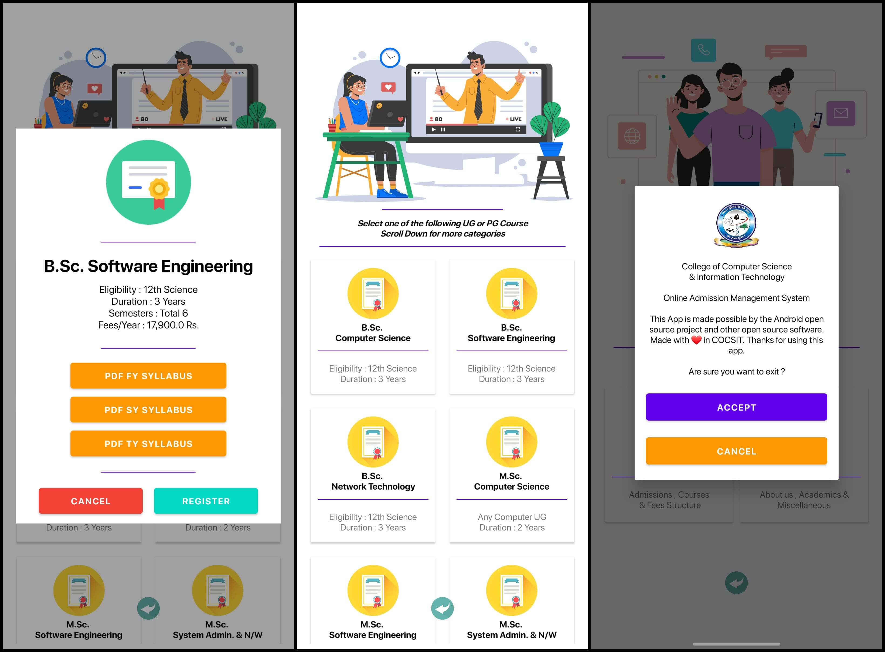
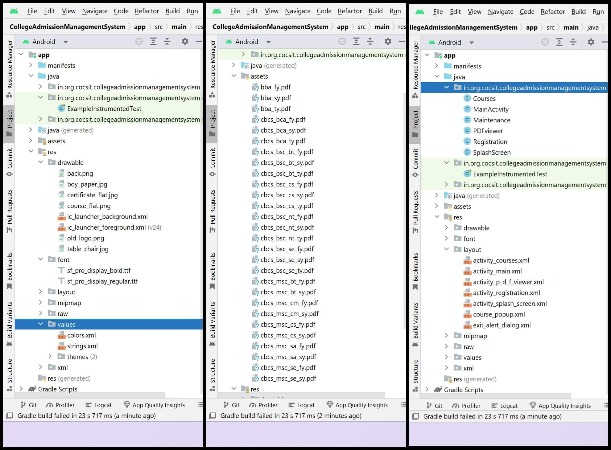
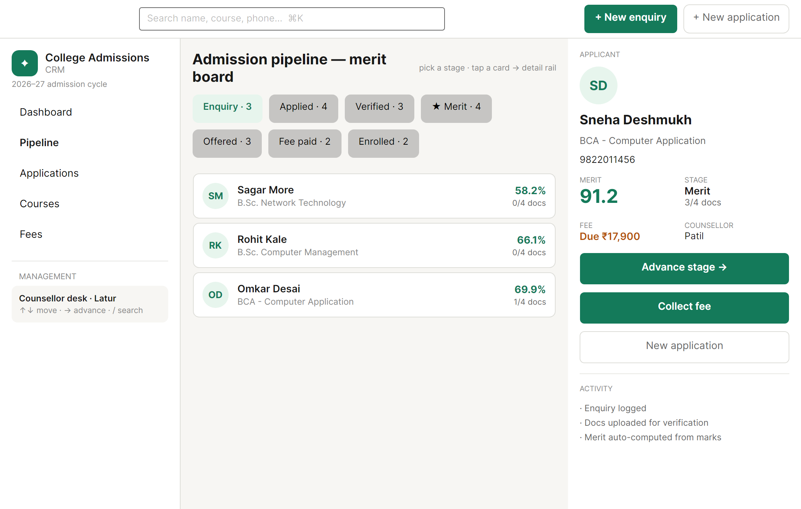
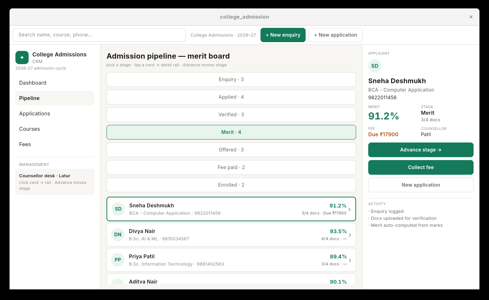
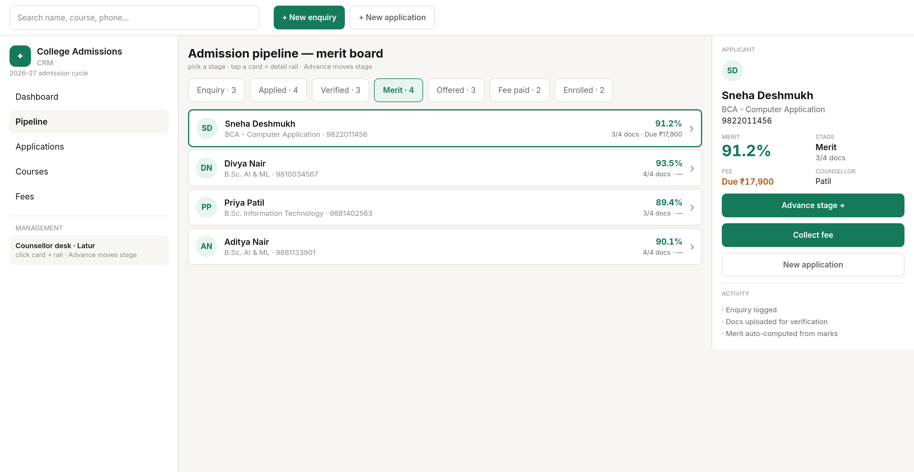
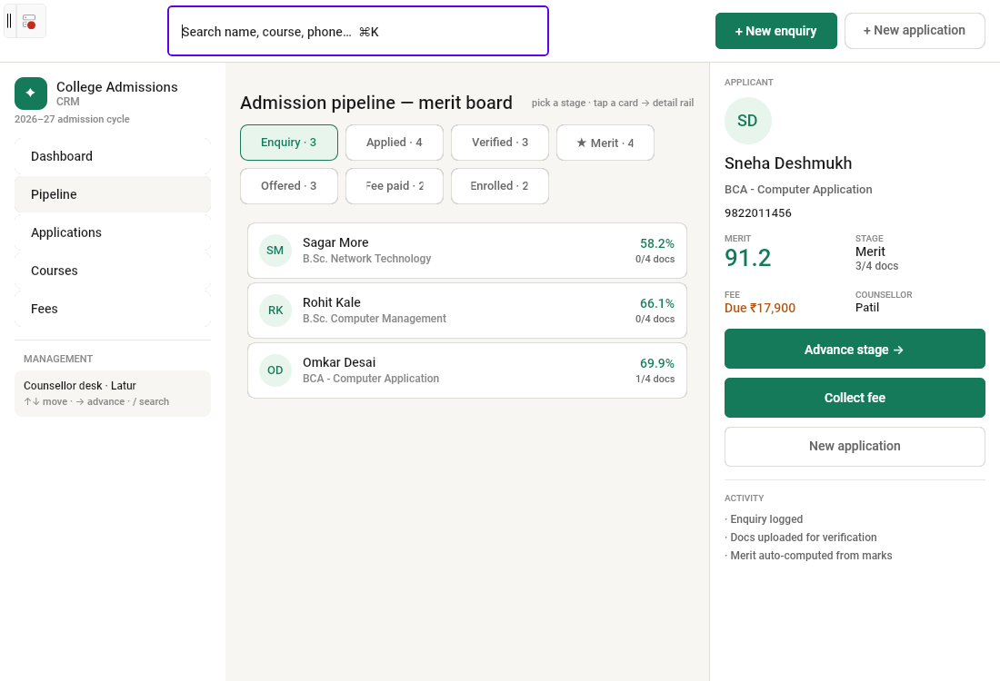
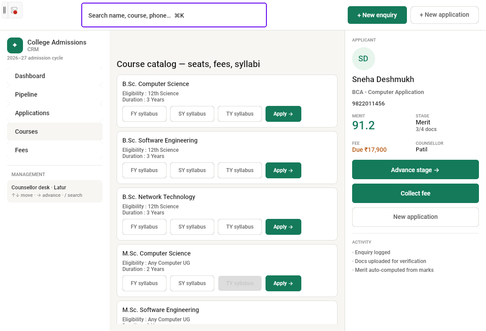
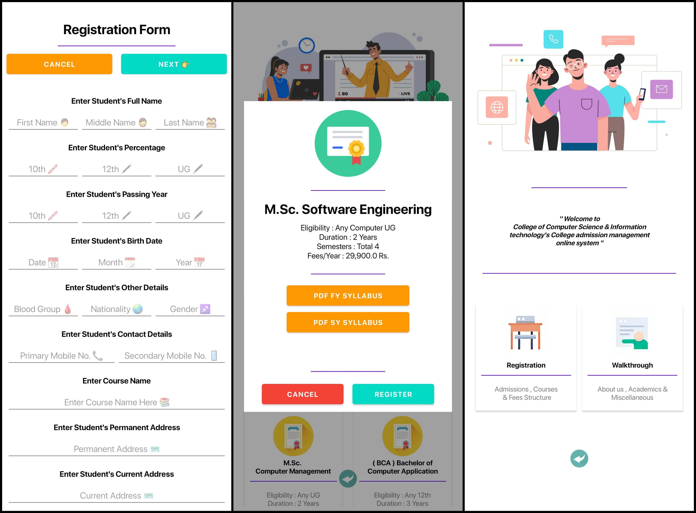

# College Admission Management System

CollegeAdmissionManagementSystem is used by schools, colleges & institutions for admission processes and study material management. Light weight yet feature-rich, built for maximum performance and security. Flexible enough to customize on the basis of your needs so as to run a smooth and efficient system.

Five codebases live in `src/`:

| Codebase | Stack | Targets today |
|---|---|---|
| `src/AvaloniaUi/` | .NET 10 + Avalonia 12 | Android, Desktop (Linux/macOS/Windows) |
| `src/FlutterUi/` | Flutter 3.47 + Dart 3.13 | Linux desktop today; Android/iOS/macOS/Windows same codebase |
| `src/PlatformUno/` | .NET 10 + Uno Platform 6 | Android, Desktop, bare `net10.0` |
| `src/TauriUi/` | Tauri 2 + React 19 + Vite | Linux/macOS Desktop (webview) |
| `src/AndroidJava/` | Java + Android SDK (archived, see `src/AndroidJava/README.md`) | Android 4.4+ (API 19+) |

# To run the app

**Avalonia (`src/AvaloniaUi/CollegeAdmission/`)** — primary app:
- Desktop: `dotnet run --project CollegeAdmission.Desktop -f net10.0`
- One Desktop binary serves Linux/macOS/Windows — no OS-specific code, so macOS and Linux are in parity by construction (verified 2026-09-19: build 0 warnings/0 errors, stable run on Fedora/X11, all UI visible, resizable 1100×700 default / 800×600 min)
- Window matches the Flutter/Tauri CRM reference: titlebar carries search + 2 CTAs only (stats live on Dashboard cards), Pipeline is stage tabs + vertical list with zero horizontal scrolling, narrow breakpoint at 760dp, forced `Light` theme (system Dark made unstyled text invisible on the light CRM tokens)
- Linux/X11 uses forced software rendering in `CollegeAdmission.Desktop/Program.cs` (Mesa GLX segfault workaround)
- Android: open `CollegeAdmission.slnx` in Rider/VS and deploy the `CollegeAdmission.Android` head to device
- Needs internet for syllabus PDFs (online URLs) and no permissions otherwise
- Sensor: disable Auto Rotation for the original portrait layout feel

**Flutter (`src/FlutterUi/college_admission/`)** — CRM port for look/feel/performance comparison:
- SDK: `~/flutter_sdk/flutter` (3.47.4 stable, on PATH); system deps: `clang cmake ninja-build gtk3-devel`
- Desktop: `flutter run -d linux` (dev) or `flutter build linux --release` → `build/linux/x64/release/bundle/`
- Mirrors the Avalonia CRM (same seed data, `CrmColors` tokens, Inter font); pipeline is stage tabs + list, no horizontal scrolling
- Checks: `flutter analyze && flutter test`

**Uno (`src/PlatformUno/CollegeAdmission/`)** — CRM port (same new UI/UX as Flutter/Tauri/Avalonia; the legacy Splash/MainMenu/Courses/Registration pages, old ViewModels, images and Lottie files were deleted 2026-09-19):
- Desktop: `dotnet run --project CollegeAdmission -f net10.0-desktop` (single-page `CrmShellPage`: titlebar search + 2 CTAs, nav 248 + content + rail 320, stage tabs + vertical pipeline, 760dp breakpoint, zero horizontal scroll)
- Linux requires `<SkiaSharpVersion>4.152.0</SkiaSharpVersion>` in `CollegeAdmission.csproj` — without it Uno.Sdk floors the Linux `libSkiaSharp` at 3.119 (m119) while managed SkiaSharp 4.152 refuses to load it, crashing at startup
- Window: resizable 1100×750 default via `AppWindow.Resize` (re-asserted after `Activate`, X11 WMs may drop the pre-Activate size); `UNO_DISPLAY_SCALE_OVERRIDE` defaults to `1.0` in `Platforms/Desktop/Program.cs` because XWayland reports unreliable `Xft.dpi` (192) that would double the whole UI — override with `UNO_DISPLAY_SCALE_OVERRIDE=2.0` on true-HiDPI X11
- Verified 2026-09-19: build 0 warnings/0 errors, all 5 sections screenshotted on Fedora/X11 with no exceptions, tests 5/5 pass
- Android: deploy the `net10.0-android` target to device
- Tests: `dotnet test CollegeAdmission.Tests/CollegeAdmission.Tests.csproj`

**Legacy Java (`src/AndroidJava/`)** — archived reference:
- Open `src/AndroidJava/` in Android Studio and Run, or `./gradlew installDebug` from that folder
- Runs on Android `4.4 KitKat (API 19) or above`; works fully offline (28 bundled PDFs)
- Permissions: none required; disable Auto Rotation

**Tested devices:**
- Samsung M51 — Android 12 (Avalonia + Uno Android heads, Java app)
- iPhone 16 Plus — iOS 26 (no iOS head configured yet, see pending)
- MacBook Pro M5 Pro — macOS 26 (Desktop heads)
- Lenovo Yoga X1 Gen 2 — Fedora 44 (Desktop heads, `dotnet` 10.0.401 verified; Flutter Linux head, Impeller, verified)

 

# Screenshots (Linux, 2026-09-19 — all 4 apps running)

All shots live in `images/apps/` (per-app folders).

| App | Shot | What it proves |
|---|---|---|
| Avalonia | `apps/avalonia/pipeline.png` | Stage tabs + vertical list, all nav/rail visible, no horizontal scroll |
| Flutter | `apps/flutter/pipeline.png` | Reference UI (unchanged): `analyze` clean, 10/10 tests pass |
| Tauri | `apps/tauri/pipeline.png` | Reference UI (unchanged): web tests 5/5, release binary runs clean |
| Uno | `apps/uno/pipeline.png`, `apps/uno/courses.png` (+ dashboard/applications/fees verified) | Full CRM reimplementation: same shell, tabs, rail as the other three |
| Android-Java (legacy reference) | `apps/android-java/*.jpg` | Archived Java app UI + project structure that the CRM ports replace |

## Avalonia — admission pipeline

## Flutter — admission pipeline (reference)

## Tauri — admission pipeline (reference)

## Uno — admission pipeline

## Uno — course catalog

## Android-Java — legacy UI (archived reference, `src/AndroidJava/`)

## Android-Java — legacy project structure

# To develop the app

**.NET apps (Avalonia + Uno):**
- SDK: `.NET 10 (10.0.401 verified)` + Android workload for the mobile heads
- IDE: Rider, VS 2022+, or VS Code + C# Dev Kit
- Hardware: `8GB RAM + 30GB free storage`
- OS: Fedora 44, macOS 26, or Windows 10+ (Xcode 26 + Apple Dev account only when the iOS head lands)

**Legacy Java app:**
- IDE: `Android Studio v2022.1.1 or above`
- SDK: `Android SDK v33 or above` (Gradle 7.5 wrapper, AGP 7.4.1, `minSdk 19 / targetSdk 33`)
- Hardware: `8GB RAM + 30GB free storage`

# Project dependencies

**Avalonia (`Directory.Packages.props`, centrally managed):**
- Avalonia `: 12.1.2` (Themes.Fluent, Fonts.Inter, Desktop, Android, iOS)
- CommunityToolkit.Mvvm `: 8.4.2`
- Avalonia.Labs.Lottie `: 12.0.2`
- Xamarin.AndroidX.Core.SplashScreen `: 1.0.1.15`

**Uno (`global.json` → Uno.Sdk `: 6.7.22`, features: Material, Mvvm, SkiaRenderer):**
- SkiaSharp.Views.Uno.WinUI / SkiaSharp.Skottie `: 4.152.0`
- CommunityToolkit.Mvvm `: 8.4.2`
- Tests: NUnit `: 4.1.0` + NUnit3TestAdapter + Microsoft.NET.Test.Sdk

**Legacy Java (`src/AndroidJava/app/build.gradle`):**
- androidx.appcompat:appcompat `: 1.6.1`
- com.google.android.material:material `: 1.8.0`
- androidx.constraintlayout:constraintlayout `: 2.1.4`
- junit : junit `: 4.13.2`
- androidx.test.ext : junit `: 1.1.5`
- androidx.test.espresso:espresso-core `: 3.5.1`
- com.daimajia.androidanimations : library `: 2.4@aar`
- com.airbnb.android:lottie `: 3.6.0`
- com.orhanobut:dialogplus `: 1.11@aar`
- com.github.barteksc:android-pdf-viewer `: 3.2.0-beta.1`
- com.squareup.okhttp3:okhttp `: 4.9.1`
