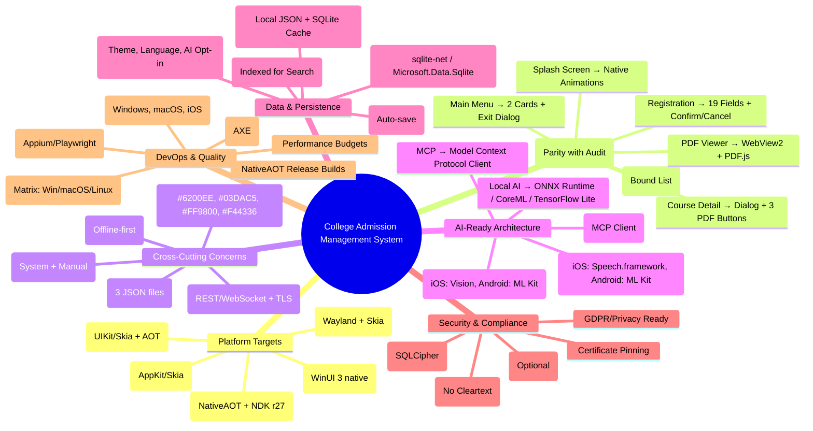

# College Admission Management System — Master Modernization Plan

**Version:** 1.1  
**Date:** September 14, 2026  
**Status:** In Progress — Uno UI port + layering landed (see Implementation Log)  
**Target Platforms:** Windows x64, macOS arm64, iOS arm64, Android arm64, Linux (Fedora) x64/arm64

---

## Implementation Log

### 2026-09-14 — Uno layered UI port (Uno.Sdk 6.7.22, .NET 10)
- **Layers:** new `CollegeAdmission.Core` (net10.0) holds `Models` (Course + card-text props), `ViewModels`, `Services` (`ILauncherService`, `INavigationService`). UI head keeps Pages + `FrameNavigationService`/`UnoLauncherService`. Tests now target Core (4/4 green, incl. new launcher seam test). Covers Phase 0 multi-project layout and the `INavigationService` abstraction from the tree map.
- **Lottie (official path):** `Lottie` UnoFeature → `Uno.WinUI.Lottie` 6.7.103; `SkiaSharp.Views.Uno.WinUI` + `SkiaSharp.Skottie` 4.152.0 for Skia Desktop. `AnimatedVisualPlayer` + `LottieVisualSource` (`xmlns:lottie="using:CommunityToolkit.WinUI.Lottie"`). JSONs live once in `Assets/Lottie/` as `Content`, referenced via `ms-appx:///Assets/Lottie/*.json` — no Android-asset duplication needed in single-project (fallback if an Android device ever misses one: copy to `Platforms/Android/Assets/Lottie/` as `AndroidAsset`).
- **Wired animations (mirrors legacy Java):** `get_in_touch.json` header on MainMenu (245dp, autoplay+loop), `tutorials_online.json` header on Courses (240dp, autoplay+loop), `caution_anim.json` in course dialog, played only when FY syllabus is missing (MBA case, same trigger as `Courses.java:193`). `programmerx.json` is unreferenced in the Java app too — deliberately not bundled.
- **Pages:** `SplashPage` (logo 300 + titles + version, 3s → Main, matches Avalonia), `MainMenuPage` (2 cards + exit overlay with ❤ text), `CoursesPage` (`GridView` + `VariableSizedWrapGrid`, max 2 cols, fixed 170×190 cards — `ItemsWrapGrid` is not implemented in Uno, verified via build warning), course dialog (FY/SY/TY buttons collapse when missing instead of overlapping the caution animation), `RegistrationPage` (sectioned form + emoji placeholders + confirm/cancel overlays, REGISTER pre-fills course name via nav parameter). Legacy `MainPage` removed.
- **Verified:** `net10.0-desktop` builds with 0 warnings/errors; assets land in output; Desktop Lottie path compiles. Android/Windows heads need a machine with the respective workloads (this Mac has none installed) — UI code is shared, so risk is packaging-only.
- **Device A/B verdict (2026-09-14):** Debug Avalonia 12 build felt extremely smooth on-device; Uno Release + full native AOT (222 assemblies) still felt choppy (white flash on navigation, slow scrolling). Decision: **proceed with Avalonia 12** for this app. Uno port retained in `src/PlatformUno/` untouched; `CollegeAdmission.Core` layering pattern (service abstractions, launcher seam test) is reusable if the Avalonia app is layered the same way.
- **Avalonia layered (2026-09-14):** same split applied under `src/AvaloniaUi/CollegeAdmission/` — new `CollegeAdmission.Core` (12-card `Course` catalog, `MainViewModel`/`RegistrationViewModel`, `ILauncherService`/`INavigationService`); head keeps Views + `AppShell`/`ViewNavigationService`/`AvaloniaLauncherService`. View code-behind untouched except `CoursesView` (syllabus via `OpenSyllabusCommand`, launcher resolved from active `TopLevel`). Layered Debug build deployed to device and running.
- **Avalonia Lottie (2026-09-14):** `Avalonia.Labs.Lottie` 12.0.2 (official AvaloniaUI labs, Skottie-backed, net10.0-android compatible). Same 3 JSONs in `Assets/Lottie/` as `AvaloniaResource`, referenced as `/Assets/Lottie/*.json`: `get_in_touch` header on MainMenu, `tutorials_online` header on Courses (both autoplay+loop, matching Java), `caution_anim` in course dialog (`AutoPlay="False"`, `Start()` only when FY missing). Device build clean, animations load with no errors.
- **Java archival + tri-app parity audit (2026-09-14):** legacy Android-native app moved `app/` → `src/Java/app/` via `git mv` (history preserved); `settings.gradle` remaps `:app` to `src/Java/app` so Gradle still builds it from repo root; root `README.md` + new `src/Java/README.md` record active (`src/AvaloniaUi/` shipping, `src/PlatformUno/` retained port) vs archived status. Java kept as behavior/reference spec — do not delete until Phase 5 backend + offline-PDF replacements land in the .NET apps.
- **Parity verdict: the 3 apps are NOT identical.** Uno catalog has 21 courses (expanded NEP: AI&ML, Data Science, MCA, B.Voc…), Avalonia has 12 (legacy only); `Course` record shapes differ (`Id/Name/Eligibility/Duration/FeePerYear` vs `Id/CardTitle/CardSubtitle/PopupSubtitle`); ViewModels differ (`CoursesViewModel` vs `MainViewModel`); Java's 28 bundled offline PDFs + in-app viewer became online URLs → external browser in both .NET apps; Java's registration WebSocket (`ws://<host>:9999`, `$`-delimited, `Registration.java`) became local JSON file saves ("backend sync pending (Phase 5)" noted only in Uno); Avalonia has no tests while Uno `CatalogTests` is 4/4 green but asserts legacy names. Verified: Uno `dotnet test` 4/4 passed.
- **Still pending:** (1) unify catalogs — port the 21-course list + one `Course` shape into Avalonia or extract a shared Core; (2) Avalonia test coverage; (3) Phase 5 backend decision (REST/Firebase/Supabase) replacing the `$`-delimited protocol; (4) offline/in-app PDF parity; (5) SQLite drafts + encryption (currently flat JSON files); (6) Phases 6–7 CI matrix, signing/packaging, theme/i18n, AI hooks (see Open Decisions).

---

## Executive Summary

This document consolidates findings from three companion analyses (`modernization-audit.html`, `avalonia-migration-plan.html`, `uno-platform-migration-plan.html`) into a single actionable master plan for rebuilding the College Admission Management System as a **cross-platform, AI-ready application** using **.NET 10 + Uno Platform**.

### Why Uno Platform?
| Factor | Decision |
|--------|----------|
| **Material Theming** | First-party `Uno.Themes` (Material, Fluent, Cupertino) |
| **Lottie Animations** | First-party `Uno.WinUI.Lottie` — existing JSON files work unchanged |
| **AI Tooling** | Explicit "Agentic Skills" for **Claude Code**, GitHub Copilot, Codex, Cursor, Cline, Aider |
| **i18n/RTL** | Built-in IME composition, RTL, font fallback — future-proof for Marathi/Hindi |
| **Windows** | Native WinUI 3/WinAppSDK — not an emulation |
| **PDF Viewer** | WebView2 + PDF.js path (same maturity gap as Avalonia, different approach) |
| **NativeAOT** | Measured on 5 platforms (Android 61%, macOS 59%, iOS 21%) |

---

## 🌳 Tree Map — System Architecture

```
CollegeAdmissionManagementSystem (Solution)
│
├── 📁 src/
│   ├── 📁 CollegeAdmission.Core/                    # Shared business logic (net10.0)
│   │   ├── 📁 Models/
│   │   │   ├── Course.cs                            # Course record (12 programs)
│   │   │   ├── RegistrationData.cs                  # 19-field registration DTO
│   │   │   ├── SyllabusEntry.cs                     # PDF metadata
│   │   │   └── UserPreferences.cs                   # Theme, language, AI settings
│   │   ├── 📁 Services/
│   │   │   ├── ICourseService.cs                    # Course catalog logic
│   │   │   ├── IRegistrationService.cs              # Registration workflow
│   │   │   ├── IPdfService.cs                       # PDF loading/rendering
│   │   │   ├── INetworkService.cs                   # Backend communication
│   │   │   ├── ISqliteService.cs                    # Local data (sqlite-net/Microsoft.Data.Sqlite)
│   │   │   ├── IAiService.cs                        # AI features (voice, text, vision, MCP)
│   │   │   └── IThemeService.cs                     # Dark/Light theme management
│   │   ├── 📁 ViewModels/
│   │   │   ├── BaseViewModel.cs                     # MVVM base with CommunityToolkit.Mvvm
│   │   │   ├── SplashViewModel.cs
│   │   │   ├── MainViewModel.cs
│   │   │   ├── CoursesViewModel.cs
│   │   │   ├── CourseDetailViewModel.cs
│   │   │   ├── PdfViewerViewModel.cs
│   │   │   └── RegistrationViewModel.cs
│   │   ├── 📁 Navigation/
│   │   │   ├── INavigationService.cs                # Abstraction over Uno navigation
│   │   │   └── NavigationService.cs
│   │   └── 📁 Infrastructure/
│   │       ├── ServiceCollectionExtensions.cs       # DI registration
│   │       └── Result.cs                            # Result<T> pattern for error handling
│   │
│   ├── 📁 CollegeAdmission.UI/                      # Shared UI (Uno.Sdk single project)
│   │   ├── 📁 Views/
│   │   │   ├── SplashPage.xaml/.cs
│   │   │   ├── MainPage.xaml/.cs
│   │   │   ├── CoursesPage.xaml/.cs
│   │   │   ├── CourseDetailDialog.xaml/.cs          # ContentDialog (WinUI-native)
│   │   │   ├── PdfViewerPage.xaml/.cs               # WebView2 + PDF.js
│   │   │   └── RegistrationPage.xaml/.cs
│   │   ├── 📁 Resources/
│   │   │   ├── Themes/
│   │   │   │   ├── MaterialLightTheme.xaml          # Uno.Themes Material Light
│   │   │   │   ├── MaterialDarkTheme.xaml           # Uno.Themes Material Dark
│   │   │   │   └── ThemeResources.xaml              # Shared colors (#6200EE, #03DAC5, #FF9800, #F44336)
│   │   │   ├── Styles/
│   │   │   │   ├── CommonStyles.xaml
│   │   │   │   ├── AnimationStyles.xaml             # Storyboard replacements for YoYo
│   │   │   │   └── LottieStyles.xaml                # Uno.WinUI.Lottie integration
│   │   │   └── Assets/
│   │   │       ├── Lottie/                          # tutorials_online.json, get_in_touch.json, caution_anim.json
│   │   │       ├── Images/
│   │   │       └── Fonts/
│   │   ├── 📁 Converters/
│   │   │   ├── BoolToVisibilityConverter.cs
│   │   │   ├── ThemeToColorConverter.cs
│   │   │   └── CourseToPdfListConverter.cs
│   │   └── 📁 Behaviors/
│   │       ├── AutoPlayLottieBehavior.cs
│   │       └── FocusBehavior.cs
│   │
│   ├── 📁 CollegeAdmission.Platforms.Windows/       # win-x64 (MSIX/.exe)
│   │   ├── Program.cs                               # WinUI 3 entry point
│   │   ├── Package.appxmanifest
│   │   └── PlatformSpecific/
│   │       ├── WindowsThemeIntegration.cs           # System theme listener
│   │       └── WindowsFilePicker.cs                 # Native file access
│   │
│   ├── 📁 CollegeAdmission.Platforms.macOS/         # osx-arm64 (.app/.dmg)
│   │   ├── Program.cs
│   │   ├── Info.plist
│   │   └── PlatformSpecific/
│   │       ├── MacThemeIntegration.cs               # NSAppearance listener
│   │       ├── MacNotarization.cs                   # Notarization helpers
│   │       └── MacFilePicker.cs
│   │
│   ├── 📁 CollegeAdmission.Platforms.iOS/           # ios-arm64 (App Store/TestFlight)
│   │   ├── Program.cs
│   │   ├── Info.plist
│   │   ├── Entitlements.plist
│   │   └── PlatformSpecific/
│   │       ├── IosThemeIntegration.cs               # UITraitCollection listener
│   │       ├── IosSqliteProvider.cs                 # praeclarum/sqlite-net or Microsoft.Data.Sqlite
│   │       ├── IosPermissions.cs                    # Camera, Mic, Speech permissions
│   │       └── IosAiIntegration.cs                  # CoreML, Vision, Speech framework hooks
│   │
│   ├── 📁 CollegeAdmission.Platforms.Android/       # android-arm64 (AAB/APK)
│   │   ├── MainActivity.cs
│   │   ├── AndroidManifest.xml
│   │   └── PlatformSpecific/
│   │       ├── AndroidThemeIntegration.cs           # AppCompatDelegate listener
│   │       ├── AndroidSqliteProvider.cs             # Microsoft.Data.Sqlite (net10.0-android)
│   │       ├── AndroidPermissions.cs                # Runtime permissions
│   │       └── AndroidAiIntegration.cs              # ML Kit, MediaPipe hooks
│   │
│   └── 📁 CollegeAdmission.Platforms.Linux/         # linux-x64/arm64 (AppImage/Flatpak)
│       ├── Program.cs
│       ├── PlatformSpecific/
│       │   ├── LinuxThemeIntegration.cs             # GTK/Qt theme detection
│       │   ├── LinuxFilePicker.cs                   # Portal/FileChooser
│       │   └── WaylandIntegration.cs                # Native Wayland backend (Uno 12.1+)
│
├── 📁 tests/
│   ├── 📁 CollegeAdmission.Core.Tests/              # xUnit + Moq
│   ├── 📁 CollegeAdmission.UI.Tests/                # Avalonia.Headless / Uno Headless
│   └── 📁 CollegeAdmission.Integration.Tests/       # Playwright / Appium
│
├── 📁 build/
│   ├── 📁 ci/                                       # GitHub Actions / Azure Pipelines
│   ├── 📁 scripts/                                  # Build, sign, package scripts
│   └── 📁 docker/                                   # Linux build containers
│
├── 📁 docs/
│   ├── modernization-audit.html
│   ├── avalonia-migration-plan.html
│   ├── uno-platform-migration-plan.html
│   └── modernization-master-plan.md               # THIS FILE
│
├── 📁 assets/                                       # 36 Syllabus PDFs (12 MB)
│   └── syllabi/
│       ├── bsc/    ├── msc/    ├── bca/    ├── bba/    └── mba/
│
└── 📁 .github/
    └── workflows/
        ├── build.yml
        ├── test.yml
        ├── release.yml
        └── ai-integration.yml                       # Future: MCP server, AI model CI
```

---

## 🧠 Mind Map — Feature & Technical Domains



---

## 🎯 Step-by-Step Phased Roadmap

### Phase 0: Foundation & Scaffold (Week 1-2)
**Goal:** Running "Hello World" on all 5 platforms

| Task | Platform | Details |
|------|----------|---------|
| Install .NET 10 SDK (10.0.302+) | All | `dotnet --version` |
| Install Uno.Sdk template | All | `dotnet new install Uno.Sdk` |
| Create solution + single project | All | `dotnet new unoapp -o CollegeAdmission` |
| Configure multi-targeting | All | `TargetFrameworks: net10.0;net10.0-windows10.0.19041;net10.0-macos14;net10.0-ios;net10.0-android36;net10.0-linux` |
| Verify build on each platform | All | `dotnet build -f net10.0-<tfm>` |
| Set up GitHub Actions matrix | CI | Windows, macOS, Ubuntu (Fedora-like) |
| **Mac Setup** | macOS/iOS | Xcode 26, Apple Developer Account ($99/yr) |
| **Windows Setup** | Windows | Visual Studio 2022 + WinAppSDK, Code Sign Cert |
| **Linux Setup** | Fedora | `dnf install dotnet-sdk-10.0 clang lld llvm` |

**Deliverable:** Blank app launching on all 5 targets

---

### Phase 1: Theme System & Static Pages (Week 2-3)
**Goal:** Pixel-perfect Material theme with Dark/Light support

| Task | Details |
|------|---------|
| Integrate `Uno.Themes` (Material) | `Uno.Themes.Material` NuGet |
| Define `ThemeResources.xaml` with audit colors | Primary #6200EE, Secondary #03DAC5, Orange #FF9800, Red #F44336 |
| Create `MaterialLightTheme.xaml` / `MaterialDarkTheme.xaml` | Extend Uno.Themes, override palette |
| Implement `IThemeService` | System theme listener + manual override + persistence |
| Platform theme listeners | Windows: `App.Current.RequestedTheme`, macOS: `NSAppearance`, iOS: `UITraitCollection`, Android: `AppCompatDelegate`, Linux: GTK/Qt portal |
| Build `SplashPage` | Replace YoYo with WinUI `Storyboard`/`Composition` animations |
| Build `MainPage` | Two `Card` controls bound to commands |
| Add Lottie integration | `Uno.WinUI.Lottie` — drop in 3 JSON files |
| **Dark mode verification** | Test `prefers-color-scheme` on all platforms |

**Deliverable:** Splash → Main navigation working, theme toggles instantly

---

### Phase 2: Course Catalog & Data Layer (Week 3-4)
**Goal:** Replace 12-way switch with data-driven architecture

| Task | Details |
|------|---------|
| Create `Course.cs` record | Id, Name, Degree, Details, Fee, PdfFiles[3], Eligibility |
| Embed course data as JSON | `Assets/Data/courses.json` (source of truth) |
| Implement `ICourseService` | Load from JSON → SQLite cache |
| Build `CoursesViewModel` | `ObservableCollection<Course>` + `SelectedCourse` |
| Build `CoursesPage` | `ItemsRepeater`/`ListView` with `DataTemplate` |
| Implement `CourseDetailDialog` | `ContentDialog` with dynamic PDF buttons |
| **Fix BBA PDF bug** | Map `cbcs_bba_*.pdf` → actual `bba_*.pdf` assets |
| Add PDF metadata index | SQLite FTS5 for syllabus search |

**Deliverable:** 12-course catalog, tap → dialog → PDF buttons work

---

### Phase 3: PDF Viewer Spike & Implementation (Week 4-5)
**Goal:** Reliable cross-platform PDF rendering

| Option | Approach | Pros | Cons |
|--------|----------|------|------|
| **WebView2 + PDF.js** (Recommended) | Uno's `WebView2` control + bundled PDF.js | Works on all 5 platforms, mature, search/text selection | Larger bundle (~8MB), WebView2 init latency |
| **PDFium + SkiaSharp** | Custom control wrapping PDFium native | Fast, native feel, no web deps | Complex native interop per platform |
| **Commercial (Telerik/Async)** | Paid license | Supported, feature-complete | Cost, licensing |

**Spike Tasks:**
1. Create minimal `PdfViewerPage` with `WebView2`
2. Load local asset PDF via `ms-appx-web://` / `file://` / `content://`
3. Test on all 5 platforms (especially iOS AOT + Android NDK r27)
4. Add pinch-zoom, text search, page navigation
5. Implement `IPdfService` abstraction

**Deliverable:** Working PDF viewer on all platforms

---

### Phase 4: Registration UI & Local Persistence (Week 5-6)
**Goal:** 19-field form with offline drafts & validation

| Task | Details |
|------|---------|
| Create `RegistrationData` record | 19 fields matching audit (name, DOB, blood group, phones, address, etc.) |
| Build `RegistrationPage` | `ScrollViewer` + grouped `StackPanel` sections |
| Implement validation | `System.ComponentModel.DataAnnotations` + custom rules |
| Auto-save drafts to SQLite | `ISqliteService` → `RegistrationDrafts` table |
| `ContentDialog` for Confirm/Cancel | WinUI-native, no third-party deps |
| Platform SQLite providers | iOS: `praeclarum/sqlite-net` (AOT-friendly) or `Microsoft.Data.Sqlite`; Android/Windows/macOS/Linux: `Microsoft.Data.Sqlite` |
| **Security**: Encrypt PII at rest | SQLCipher or `Microsoft.Data.Sqlite` with encryption extension |

**Deliverable:** Full registration form, draft persistence, confirm dialog

---

### Phase 5: Backend Integration & Network Layer (Week 6-7)
**Goal:** Replace broken WebSocket with production-ready API

| Decision Required | Options |
|-------------------|---------|
| **Protocol** | REST/HTTPS (recommended) + WebSocket for real-time |
| **Auth** | JWT + Refresh tokens, or Firebase Auth / Azure AD B2C / Supabase |
| **Hosting** | Azure Container Apps, AWS ECS, Railway, Fly.io, or self-hosted |
| **API Contract** | OpenAPI 3.1 spec → `NSwag`/`Kiota` generated client |

| Task | Details |
|------|---------|
| Define OpenAPI spec | `/api/v1/registration`, `/api/v1/courses`, `/api/v1/syllabi` |
| Implement `INetworkService` | `HttpClient` + `Polly` retry + `Refit`/`Kiota` typed client |
| Add `NetworkSecurityConfig` | TLS 1.3 only, certificate pinning |
| Implement registration submit | `POST /registration` with JSON body (not `$`-delimited!) |
| Add offline queue | `BackgroundService` syncs when online |
| **iOS AOT compatibility** | Avoid reflection-heavy serializers (use `System.Text.Json` source gen) |

**Deliverable:** Registration actually works against real backend

---

### Phase 6: NativeAOT, Packaging & Store Submission (Week 7-9)
**Goal:** Production-ready binaries for all stores

| Platform | Build Command | Output | Signing |
|----------|---------------|--------|---------|
| **Windows** | `dotnet publish -f net10.0-windows10.0.19041 -c Release -p:PublishAot=true` | `.exe` / MSIX | Code Sign Cert (DigiCert/Sectigo ~$200/yr) |
| **macOS** | `dotnet publish -f net10.0-macos14 -c Release -p:PublishAot=true` | `.app` | Apple Notarization (requires $99/yr Dev Account) |
| **iOS** | `dotnet publish -f net10.0-ios -c Release -p:PublishAot=true` | `.ipa` | Xcode Archive → App Store Connect |
| **Android** | `dotnet publish -f net10.0-android36 -c Release -p:PublishAot=true -p:AndroidNdkVersion=r27` | `.aab` | `jarsigner` + `apksigner` (Google Play $25 one-time) |
| **Linux** | `dotnet publish -f net10.0-linux -c Release -p:PublishAot=true` | AppImage / Flatpak | GPG sign (optional) |

**NativeAOT Caveats:**
- Publish time: 10-12x longer
- Reflection/Trimming: Use `[DynamicallyAccessedMembers]`, `JsonSerializerContext`
- iOS: Test thoroughly — 21% startup gain, but trimming breaks more things
- Bundle size: +12-41% vs JIT

---

### Phase 7: AI-Ready Architecture (Week 9-12) — **Future-Proofing**
**Goal:** Pluggable AI integration points for Voice, Text, Vision, MCP

#### 7.1 Voice (Speech-to-Text / Text-to-Speech)
```csharp
// Core/Services/IAiService.cs
public interface IVoiceService
{
    Task<string> SpeechToTextAsync(Stream audio, CancellationToken ct);
    Task<Stream> TextToSpeechAsync(string text, VoiceOptions options, CancellationToken ct);
    IAsyncEnumerable<PartialResult> StreamSpeechToTextAsync(Stream audio, CancellationToken ct);
}

// Platform implementations:
// - iOS: Speech.framework (SFSpeechRecognizer) + AVSpeechSynthesizer
// - Android: ML Kit Speech-to-Text + TextToSpeech API
// - Windows: Windows.Media.SpeechRecognition + SpeechSynthesis
// - macOS: SFSpeechRecognizer (Catalyst) or SpeechSynthesis
// - Linux: Piper (TTS) + Vosk/Whisper.cpp (STT) via local HTTP
```

#### 7.2 Text (NLP/LLM/MCP)
```csharp
public interface ITextAiService
{
    Task<string> CompleteAsync(string prompt, AiModel model, CancellationToken ct);
    Task<StructuredOutput<T>> ExtractAsync<T>(string text, JsonSchema schema, CancellationToken ct);
    Task<McpResponse> CallMcpAsync(McpRequest request, CancellationToken ct);
}

// MCP Client Implementation:
// - HTTP/SSE transport to MCP servers
// - Tool discovery & invocation
// - Resource subscription
```

#### 7.3 Vision (OCR / Document Understanding)
```csharp
public interface IVisionService
{
    Task<OcrResult> RecognizeTextAsync(Stream image, CancellationToken ct);
    Task<DocumentAnalysis> AnalyzeDocumentAsync(Stream pdf, CancellationToken ct);
    Task<BarcodeResult[]> ScanBarcodesAsync(Stream image, CancellationToken ct);
}

// Platform implementations:
// - iOS: Vision.framework (VNRecognizeTextRequest)
// - Android: ML Kit Text Recognition / Document Scanner
// - Windows: Windows.AI.MachineLearning + ONNX
// - macOS: Vision.framework (same as iOS via Catalyst)
// - Linux: Tesseract/PaddleOCR via local service
```

#### 7.4 Local AI Models (ONNX Runtime / CoreML / TensorFlow Lite)
```csharp
// Models bundled as Assets/Content
// - Whisper.tiny.onnx (STT) — ~39MB
// - Phi-3-mini-4k.onnx (LLM) — ~2.3GB (quantized)
// - MobileNet.onnx (Vision) — ~16MB

public interface ILocalModelService
{
    Task<ModelSession> LoadModelAsync(string modelPath, ModelOptions options);
    Task<TOutput> RunAsync<TInput, TOutput>(ModelSession session, TInput input);
}
```

#### 7.5 AI Integration Points in App
| Feature | AI Enhancement | Implementation Phase |
|---------|---------------|---------------------|
| Course Search | Semantic search (embeddings) | 7.2 |
| Registration | Voice form filling | 7.1 |
| Syllabus PDF | OCR + Summary + Q&A | 7.3 |
| Chat Assistant | MCP-connected agent | 7.2 |
| Accessibility | Screen reader + Voice control | 7.1 |
| Offline Mode | Local models (ONNX) | 7.4 |

---

## 🗄️ SQLite Strategy — Cross-Platform

### Provider Selection Matrix
| Platform | Provider | Reason |
|----------|----------|--------|
| **iOS** | `praeclarum/sqlite-net` (v1.9+) | AOT-friendly, source-gen compatible, used by MAUI |
| **Android** | `Microsoft.Data.Sqlite` (net10.0-android) | Native AOT support, same API as desktop |
| **Windows/macOS/Linux** | `Microsoft.Data.Sqlite` | Consistent API, encryption extensions available |

### Abstraction Layer
```csharp
// Core/Services/ISqliteService.cs
public interface ISqliteService
{
    Task InitializeAsync(CancellationToken ct = default);
    Task<T> GetAsync<T>(string sql, object parameters = null);
    Task<List<T>> QueryAsync<T>(string sql, object parameters = null);
    Task<int> ExecuteAsync(string sql, object parameters = null);
    Task<int> ExecuteScalarAsync<T>(string sql, object parameters = null);
    Task<IDbTransaction> BeginTransactionAsync();
    void EnableWriteAheadLogging();
    void EnableForeignKeys();
}

// Platform-specific implementations via DI:
// services.AddSingleton<ISqliteService, IosSqliteService>();    // iOS
// services.AddSingleton<ISqliteService, AndroidSqliteService>(); // Android
// services.AddSingleton<ISqliteService, DesktopSqliteService>(); // Win/Mac/Linux
```

### Schema (SQLite)
```sql
-- Courses (cached from JSON)
CREATE TABLE Courses (
    Id TEXT PRIMARY KEY,
    Name TEXT NOT NULL,
    Degree TEXT NOT NULL,
    Details TEXT,
    Fee TEXT,
    Eligibility TEXT,
    PdfFy TEXT,
    PdfSy TEXT,
    PdfTy TEXT,
    UpdatedAt TEXT DEFAULT (datetime('now'))
);

-- Registration Drafts (auto-save)
CREATE TABLE RegistrationDrafts (
    Id INTEGER PRIMARY KEY AUTOINCREMENT,
    DataJson TEXT NOT NULL,           -- Full RegistrationData as JSON
    Step INTEGER DEFAULT 0,           -- Current step/section
    CreatedAt TEXT DEFAULT (datetime('now')),
    UpdatedAt TEXT DEFAULT (datetime('now')),
    IsSubmitted INTEGER DEFAULT 0
);

-- User Preferences
CREATE TABLE UserPreferences (
    Key TEXT PRIMARY KEY,
    Value TEXT NOT NULL,
    UpdatedAt TEXT DEFAULT (datetime('now'))
);
-- Keys: Theme (Light/Dark/System), Language, AiOptIn, VoiceEnabled, etc.

-- PDF Search Index (FTS5)
CREATE VIRTUAL TABLE SyllabusSearch USING fts5(
    CourseId UNINDEXED,
    CourseName,
    Degree,
    Year,
    Content,
    tokenize='porter unicode61'
);
```

---

## 🎨 Theme System — Dark/Light/High Contrast

### Theme Architecture
```
ThemeService (Singleton)
├── CurrentTheme: ThemeMode (Light / Dark / System)
├── SystemThemeListener (per-platform)
├── ThemeChanged: Event
└── PersistToPreferences()

ResourceDictionary Merging (App.xaml):
<Application.Resources>
    <ResourceDictionary>
        <ResourceDictionary.MergedDictionaries>
            <MaterialLightTheme />     <!-- Base Uno.Themes Material Light -->
            <MaterialDarkTheme />      <!-- Base Uno.Themes Material Dark -->
            <ThemeResources />         <!-- Our color overrides -->
            <DynamicThemeOverlay />    <!-- Swapped at runtime by ThemeService -->
        </ResourceDictionary.MergedDictionaries>
    </ResourceDictionary>
</Application.Resources>
```

### Color Palette (From Audit)
| Token | Light | Dark | Usage |
|-------|-------|------|-------|
| Primary | #6200EE | #6200EE | App bar, FAB, primary buttons |
| PrimaryContainer | #E4EDFB | #16283F | Card backgrounds, chips |
| Secondary | #03DAC5 | #03DAC5 | Accent elements, selection |
| Tertiary | #FF9800 | #FF9800 | Warning, course highlights |
| Error | #F44336 | #F44336 | Validation, destructive actions |
| Surface | #FFFFFF | #111B29 | Card, dialog backgrounds |
| OnSurface | #131F2B | #E8EEF5 | Primary text |
| Outline | #D6DFE8 | #26374C | Borders, dividers |

### High Contrast Support
- Extend `ThemeResources.xaml` with `HighContrast` variants
- Use `SystemParameters.HighContrast` (Windows) / `UIAccessibility.isDarkerSystemColorsEnabled` (iOS) / `AccessibilityManager.isHighTextContrastEnabled` (Android)

---

## 🤖 AI-Ready Patterns — Implementation Guide

### 1. Dependency Injection for AI Services
```csharp
// Core/Infrastructure/ServiceCollectionExtensions.cs
public static IServiceCollection AddAiServices(this IServiceCollection services)
{
    // Voice
    services.TryAddSingleton<IVoiceService, PlatformVoiceService>();
    
    // Text/LLM/MCP
    services.TryAddSingleton<ITextAiService, McpTextAiService>();
    services.TryAddSingleton<IMcpClient, McpHttpClient>();
    
    // Vision
    services.TryAddSingleton<IVisionService, PlatformVisionService>();
    
    // Local Models
    services.TryAddSingleton<ILocalModelService, OnnxRuntimeModelService>();
    
    // Orchestration
    services.TryAddSingleton<IAiOrchestrator, AiOrchestrator>();
    
    return services;
}
```

### 2. MCP (Model Context Protocol) Client
```csharp
// Core/Services/Mcp/HttpMcpClient.cs
public class HttpMcpClient : IMcpClient
{
    private readonly HttpClient _http;
    private readonly ILogger<HttpMcpClient> _log;
    
    public async Task<McpResponse> SendAsync(McpRequest request, CancellationToken ct)
    {
        // JSON-RPC 2.0 over HTTP/SSE
        // Supports: tools/list, tools/call, resources/list, resources/read, prompts/list, prompts/get
    }
}

// Usage in RegistrationViewModel:
var result = await _aiOrchestrator.FillFormFromVoiceAsync(
    "Fill my registration with: Name Aslam Shaikh, Course BCA, Phone 9876543210");
```

### 3. Semantic Kernel / Microsoft.Extensions.AI Integration (Optional)
```csharp
// For advanced LLM orchestration
services.AddKernel()
    .AddOpenAIChatCompletion("gpt-4o-mini", apiKey)
    .AddPlugin<CoursePlugin>()
    .AddPlugin<RegistrationPlugin>()
    .AddPlugin<McpPlugin>();
```

### 4. Privacy & On-Device AI
- **Opt-in only**: `UserPreferences.AiOptIn = true`
- **Local-first**: Prefer on-device models (ONNX Runtime, CoreML, TFLite)
- **No telemetry without consent**: Clear privacy policy
- **Data minimization**: Send only required context to cloud APIs

---

## 📱 Platform-Specific Implementation Details

### Windows (win-x64)
```xml
<!-- CollegeAdmission.Platforms.Windows/Package.appxmanifest -->
<Applications>
  <Application Id="App" Executable="$targetnametoken$.exe" EntryPoint="CollegeAdmission.WinUI.App">
    <uap:VisualElements DisplayName="College Admission" 
                        Square150x150Logo="Assets\Square150x150Logo.png"
                        Square44x44Logo="Assets\Square44x44Logo.png"
                        BackgroundColor="#6200EE" />
    <Extensions>
      <uap:Extension Category="windows.protocol">
        <uap:Protocol Name="collegeadmission" />
      </uap:Extension>
    </Extensions>
  </Application>
</Applications>
<Capabilities>
  <Capability Name="internetClient" />
  <Capability Name="microphone" />      <!-- Voice AI -->
  <Capability Name="webcam" />          <!-- Vision AI -->
</Capabilities>
```

### macOS (osx-arm64)
```xml
<!-- CollegeAdmission.Platforms.macOS/Info.plist -->
<key>NSMicrophoneUsageDescription</key>
<string>Voice input for registration form filling</string>
<key>NSCameraUsageDescription</key>
<string>Document scanning for syllabus OCR</string>
<key>NSSpeechRecognitionUsageDescription</key>
<string>Speech-to-text for hands-free operation</string>
<key>LSApplicationCategoryType</key>
<string>public.app-category.education</string>
```

### iOS (ios-arm64)
```xml
<!-- CollegeAdmission.Platforms.iOS/Info.plist -->
<key>NSMicrophoneUsageDescription</key>
<string>Voice input for registration form filling</string>
<key>NSCameraUsageDescription</key>
<string>Document scanning for syllabus OCR</string>
<key>NSSpeechRecognitionUsageDescription</key>
<string>Speech-to-text for hands-free operation</string>
<key>ITSAppUsesNonExemptEncryption</key>
<false/>
<key>UIRequiredDeviceCapabilities</key>
<array>
  <string>arm64</string>
  <string>metal</string>
</array>
```
```csharp
// PlatformSpecific/IosSqliteProvider.cs
public class IosSqliteProvider : ISqliteProvider
{
    public string GetDatabasePath(string filename)
    {
        var docs = Environment.GetFolderPath(Environment.SpecialFolder.MyDocuments);
        var lib = Path.Combine(docs, "..", "Library");
        return Path.Combine(lib, filename);
    }
    
    // Use sqlite-net for AOT compatibility
    public SQLiteAsyncConnection CreateConnection(string path)
    {
        return new SQLiteAsyncConnection(path, SQLiteOpenFlags.ReadWrite | SQLiteOpenFlags.Create | SQLiteOpenFlags.FullMutex);
    }
}
```

### Android (android-arm64)
```xml
<!-- CollegeAdmission.Platforms.Android/AndroidManifest.xml -->
<uses-permission android:name="android.permission.INTERNET" />
<uses-permission android:name="android.permission.RECORD_AUDIO" />
<uses-permission android:name="android.permission.CAMERA" />
<uses-permission android:name="android.permission.READ_EXTERNAL_STORAGE" />
<uses-permission android:name="android.permission.WRITE_EXTERNAL_STORAGE" />
<uses-permission android:name="android.permission.POST_NOTIFICATIONS" />

<application android:allowBackup="false" 
             android:fullBackupContent="@xml/backup_rules"
             android:networkSecurityConfig="@xml/network_security_config"
             android:extractNativeLibs="true">
```
```csharp
// PlatformSpecific/AndroidSqliteProvider.cs
public class AndroidSqliteProvider : ISqliteProvider
{
    public string GetDatabasePath(string filename)
    {
        return Path.Combine(FileSystem.AppDataDirectory, filename);
    }
    
    public SqliteConnection CreateConnection(string path)
    {
        return new SqliteConnection($"Data Source={path};Mode=ReadWriteCreate;Cache=Shared");
    }
}
```

### Linux (Fedora) — Wayland + Skia
```csharp
// Program.cs (Linux head)
public static class Program
{
    [STAThread]
    public static int Main(string[] args)
    {
        BuildAvaloniaApp()
            .UseWayland()                    // Native Wayland (Uno 12.1+)
            .UseSkia()                       // Skia rendering
            .StartWithClassicDesktopLifetime(args);
    }
}

// PlatformSpecific/LinuxThemeIntegration.cs
public class LinuxThemeIntegration : ISystemThemeListener
{
    public ThemeMode GetSystemTheme()
    {
        // Try GTK first
        var gtkTheme = Gtk.Settings.Default?.GtkThemeName;
        if (!string.IsNullOrEmpty(gtkTheme) && gtkTheme.Contains("dark", StringComparison.OrdinalIgnoreCase))
            return ThemeMode.Dark;
        
        // Fallback: Qt/KDE
        var kde = Environment.GetEnvironmentVariable("KDE_COLOR_SCHEME");
        if (!string.IsNullOrEmpty(kde) && kde.Contains("dark", StringComparison.OrdinalIgnoreCase))
            return ThemeMode.Dark;
        
        // Fallback: GNOME
        var gnome = Environment.GetEnvironmentVariable("GTK_THEME");
        if (!string.IsNullOrEmpty(gnome) && gnome.Contains("dark", StringComparison.OrdinalIgnoreCase))
            return ThemeMode.Dark;
        
        return ThemeMode.Light;
    }
    
    public event Action<ThemeMode> ThemeChanged; // Listen to portal/org.freedesktop.portal.Settings
}
```

---

## 🔒 Security Checklist

| Area | Requirement | Implementation |
|------|-------------|----------------|
| **Transport** | TLS 1.3 only | `HttpClient` + `SslProtocols.Tls13`, cert pinning |
| **Auth** | JWT + Refresh | `Microsoft.Identity.Client` (MSAL) or custom |
| **Storage** | Encrypt PII | SQLCipher (SQLite) or `Microsoft.Data.Sqlite` encryption |
| **Biometric** | Optional auth | Windows Hello / Touch ID / Face ID / Android BiometricPrompt |
| **Backup** | Exclude PII | `allowBackup="false"` or custom backup rules |
| **Network Config** | Cleartext blocked | `network_security_config.xml` with `cleartextTrafficPermitted="false"` |
| **Certificate Pinning** | Production | `HttpClientHandler.ServerCertificateCustomValidationCallback` |
| **ProGuard/R8** | Release builds | Keep rules for reflection (JSON, DI, AI libs) |

---

## 📦 Build & CI/CD Pipeline

### GitHub Actions Matrix
```yaml
# .github/workflows/build.yml
strategy:
  matrix:
    os: [ubuntu-latest, windows-latest, macos-latest]
    target:
      - { os: ubuntu-latest, tfm: net10.0-linux, rid: linux-x64 }
      - { os: ubuntu-latest, tfm: net10.0-linux, rid: linux-arm64 }
      - { os: windows-latest, tfm: net10.0-windows10.0.19041, rid: win-x64 }
      - { os: macos-latest, tfm: net10.0-macos14, rid: osx-arm64 }
      - { os: macos-latest, tfm: net10.0-ios, rid: ios-arm64 }
      - { os: ubuntu-latest, tfm: net10.0-android36, rid: android-arm64 }
```

### Release Pipeline
1. **Build** → Multi-platform `dotnet publish -c Release -p:PublishAot=true`
2. **Test** → Unit (xUnit), UI (Appium headless), Accessibility (AXE)
3. **Sign** → Platform-specific signing (cert, notarization, jarsigner)
4. **Package** → MSIX, .dmg, .ipa, .aab, AppImage/Flatpak
5. **Publish** → GitHub Releases + Store submissions (manual approval)

---

## 🧪 Testing Strategy

| Layer | Framework | Target |
|-------|-----------|--------|
| **Unit** | xUnit + Moq + CommunityToolkit.Mvvm.Testing | Core, ViewModels, Services |
| **UI (Headless)** | Uno Headless / Avalonia.Headless | View rendering, navigation, bindings |
| **Integration** | Playwright (Web/WASM) + Appium (Mobile/Desktop) | E2E flows on real devices/emulators |
| **Accessibility** | AXE-core + platform inspectors | WCAG 2.1 AA |
| **Performance** | BenchmarkDotNet + NativeAOT startup | < 500ms cold start (AOT) |
| **AI Features** | Contract tests + Golden files | Voice/Text/Vision accuracy baselines |

---

## 📋 Open Decisions (Require Stakeholder Input)

| # | Decision | Options | Impact |
|---|----------|---------|--------|
| 1 | **Backend for Registration** | REST API (custom) / Firebase / Supabase / Azure Functions | Phase 5 scope, cost, maintenance |
| 2 | **PDF Viewer Approach** | WebView2+PDF.js / PDFium+Skia / Commercial (Telerik) | Phase 3 spike outcome |
| 3 | **AI Cloud vs Local** | Cloud APIs (OpenAI, Anthropic) / Local ONNX / Hybrid | Cost, privacy, offline support |
| 4 | **MCP Server** | Self-hosted / Managed (Smithery, etc.) / None yet | Phase 7.2 architecture |
| 5 | **Uno Platform Studio License** | Free (Core) / Paid (Hot Design, AI credits) | Dev velocity vs budget |
| 6 | **Linux Distribution Target** | Fedora (primary) / Ubuntu / Arch / Flatpak/Flathub | Packaging effort |
| 7 | **Localization** | English only / +Marathi / +Hindi / Full i18n | Uno i18n advantage |

---

## 📚 References & Sources

1. **Modernization Audit** — `docs/modernization-audit.html` (full source analysis)
2. **Avalonia Migration Plan** — `docs/avalonia-migration-plan.html`
3. **Uno Platform Migration Plan** — `docs/uno-platform-migration-plan.html`
4. **Uno Platform Docs** — https://platform.uno/docs/
5. **Uno.Themes** — https://github.com/unoplatform/Uno.Themes
6. **Uno.WinUI.Lottie** — https://github.com/unoplatform/uno/tree/master/src/Uno.WinUI.Lottie
7. **Agentic Skills (Claude Code)** — https://platform.uno/blog/agentic-skills-demystified/
8. **.NET 10 Announcement** — https://devblogs.microsoft.com/dotnet/announcing-dotnet-10/
9. **NativeAOT in Uno** — https://platform.uno/blog/native-aot-in-uno-platform-faster-startup-five-platforms/
10. **sqlite-net (praeclarum)** — https://github.com/praeclarum/sqlite-net
11. **Microsoft.Data.Sqlite** — https://learn.microsoft.com/dotnet/standard/data/sqlite
12. **PDF.js** — https://mozilla.github.io/pdf.js/
13. **ONNX Runtime Mobile** — https://onnxruntime.ai/docs/build/eps.html#mobile
14. **Model Context Protocol** — https://modelcontextprotocol.io/

---

## 📅 Timeline Summary

| Phase | Duration | Key Deliverable |
|-------|----------|-----------------|
| 0: Scaffold | 2 weeks | App runs on 5 platforms |
| 1: Theme & Static | 2 weeks | Splash + Main + Dark/Light |
| 2: Course Catalog | 2 weeks | Data-driven 12-course list |
| 3: PDF Viewer | 2 weeks | Working PDF on all platforms |
| 4: Registration UI | 2 weeks | 19-field form + offline drafts |
| 5: Backend | 2 weeks | Real registration API |
| 6: NativeAOT + Stores | 3 weeks | Signed store packages |
| 7: AI-Ready | 4 weeks | Voice/Text/Vision/MCP hooks |
| **Total** | **~19 weeks** | **Production-ready cross-platform app** |

---

## ✅ Next Steps

1. **Stakeholder Review** — Confirm platform priorities, backend decision, PDF approach
2. **Team Onboarding** — Uno Platform tutorials, Agentic Skills setup for Claude Code
3. **Mac Provisioning** — Xcode 26, Apple Developer Account, certificates
4. **Repository Setup** — Branch protection, CI matrix, dependabot, codeql
5. **Phase 0 Kickoff** — Generate Uno.Sdk project, verify all 5 targets build

---

*Document maintained in `docs/modernization-master-plan.md` — Update as decisions are made.*

---

## 📚 Appendix A: COCSIT Course Catalog & PDF Syllabus Links (Source: https://www.cocsit.org.in/)

**Scraped:** September 11, 2026 | **Source Pages:** Home, All Programs, Fees Structure, Syllabus | **College:** College of Computer Science and Information Technology, Latur (Autonomous) | **Affiliation:** Swami Ramanand Teerth Marathwada University, Nanded | **NAAC:** B+ Grade | **AISHE:** C-7398

### 🎓 UG Programs (Computer Programs) — 3/4 Years (NEP 2020: 4 Years with Honors/Research)

| # | Program | Code | Eligibility | Duration | Department | FY Syllabus (NEP 2024-25) | SY Syllabus (NEP 2025-26) | TY Syllabus (NEP 2026-27) |
|---|---------|------|-------------|----------|------------|---------------------------|---------------------------|---------------------------|
| 1 | **B.Sc. (Computer Science)** | B.Sc.CS | 12th Science | 3/4 Years | Computer Science | [PDF](https://www.cocsit.org.in/download/syllabus/2024-25/05BScComputerScienceSingleMajorFirstYearNEPSyllabuswef202425.pdf) | [PDF](https://www.cocsit.org.in/download/syllabus/2025-26/5BScComputerScienceSingalMajorSecondYearsyllabuswef202526.pdf) | [PDF](https://www.cocsit.org.in/download/syllabus/2026-27/B.Sc_.-III-Year-Computer-Science-Single-Major-Syllabus-2026-27.pdf) |
| 2 | **BCA** | BCA | 12th Any Faculty | 3/4 Years | Computer Application | [PDF](https://www.cocsit.org.in/download/syllabus/2024-25/2.SRTMUN-BCA-Final%2023-10-2024QP%20(2).pdf) | [PDF](https://www.cocsit.org.in/download/syllabus/2025-26/07BScBCASingalMajorSecondYearsyllabuswef202526.pdf) | [PDF](https://www.cocsit.org.in/download/syllabus/2026-27/B.C.A.-III-Year-Single-Major-Syllabus-2026-27.pdf) |
| 3 | **B.Sc. (Software Engineering)** | B.Sc.SE | 12th Science | 3/4 Years | Software Engineering | [PDF](https://www.cocsit.org.in/download/syllabus/2024-25/07BScSoftwareEngineeringSingleMajorFirstYearNEPSyllabuswef202425.pdf) | [PDF](https://www.cocsit.org.in/download/syllabus/2025-26/3BScSoftwareEngineeringSingalMajorSecondYearsyllabuswef202526.pdf) | [PDF](https://www.cocsit.org.in/download/syllabus/2026-27/B.Sc_.-III-Year-Software-Engineering-Single-Major-Syllabus-2026-27.pdf) |
| 4 | **B.Sc. (Software Development)** | B.Sc.SD | 12th Any Faculty | 3/4 Years | Software Dev. & B.Voc | [PDF](https://www.cocsit.org.in/download/syllabus/2024-25/BScSoftwareDevelopmentSingleMajorFirstYearNEPSyllabuswef202425.pdf) | [PDF](https://www.cocsit.org.in/download/syllabus/2025-26/12BScSoftwareDevelopmentSingalMajorSecondYearsyllabuswef202526.pdf) | [PDF](https://www.cocsit.org.in/download/syllabus/2026-27/B.Sc_.-III-Year-Software-Development-Single-Major-Syllabus-2026-27.pdf) |
| 5 | **B.Sc. (Data Science)** | B.Sc.DS | 12th Science | 3/4 Years | Data Science | [PDF](https://www.cocsit.org.in/download/syllabus/2024-25/BScDataScienceSingleMajorFirstYearNEPSyllabuswef202425.pdf) | [PDF](https://www.cocsit.org.in/download/syllabus/2025-26/13BScDataScienceSingalMajorSecondYearsyllabuswef202526.pdf) | [PDF](https://www.cocsit.org.in/download/syllabus/2026-27/B.Sc_.-III-Year-Data-Science-Single-Major-Syllabus-2026-27.pdf) |
| 6 | **B.Sc. (AI & ML)** | B.Sc.AIML | 12th Science | 3/4 Years | AI & ML | [PDF](https://www.cocsit.org.in/download/syllabus/2025-26/1BScFirstYearArtificialIntelligenceandMachineLearning13092025Major.pdf) | [PDF](https://www.cocsit.org.in/download/syllabus/2025-26/6BScArtificialIntelligencenMachineLearningSingalMajorSecondYearsyllabuswef202526.pdf) | [PDF](https://www.cocsit.org.in/download/syllabus/2026-27/B.Sc_.-III-Year-Artificial-Intelligence-and-Machine-Learning-AI-ML-Single-Major-Syllabus-2026-27.pdf) |
| 7 | **B.Sc. (Network Technology)** | B.Sc.NT | 12th Any Faculty | 3/4 Years | IT & CM | [PDF](https://www.cocsit.org.in/download/syllabus/2024-25/06BScComputerNetworkTechnologySingleMajorFirstYearNEPSyllabuswef202425.pdf) | [PDF](https://www.cocsit.org.in/download/syllabus/2025-26/4BScComputerNetworkTechnologySingalMajorSecondYearsyllabuswef202526.pdf) | [PDF](https://www.cocsit.org.in/download/syllabus/2026-27/B.Sc_.-III-Year-Network-Technology-Single-Major-Syllabus-2026-27.pdf) |
| 8 | **B.Sc. (Information Technology)** | B.Sc.IT | 12th Any Faculty | 3/4 Years | IT & CM | [PDF](https://www.cocsit.org.in/download/syllabus/2024-25/08BScInformationTechnologySingleMajorFirstYearNEPSyllabuswef202425.pdf) | [PDF](https://www.cocsit.org.in/download/syllabus/2025-26/2BScInformationTechnologySingalMajorSecondYearsyllabuswef202526.pdf) | [PDF](https://www.cocsit.org.in/download/syllabus/2026-27/B.Sc_.-III-Year-Information-Technology-Single-Major-Syllabus-2026-27.pdf) |
| 9 | **B.Sc. (Computer Management)** | B.Sc.CM | 12th Any Faculty | 3/4 Years | IT & CM | [PDF](https://www.cocsit.org.in/download/syllabus/2024-25/09BScComputerManagementSingleMajorFirstYearNEPSyllabuswef202425.pdf) | [PDF](https://www.cocsit.org.in/download/syllabus/2025-26/1BScComputerManagementSingalMajorSecondYearsyllabuswef202526.pdf) | [PDF](https://www.cocsit.org.in/download/syllabus/2026-27/B.Sc_.-III-Year-Computer-Management-Single-Major-Syllabus-2026-26.pdf) |
| 10 | **B.Voc. (PSSD)** | B.Voc | 12th Any Faculty | 3 Years | Software Dev. & B.Voc | [Combined FY/SY/TY](https://www.cocsit.org.in/download/syllabus/2021-22/BVocProgrammingSkillsforSoftwareDevelopmentFirstSecondThirdYear202223to20242025.pdf) | Same | Same |

### 🧬 UG Programs (Biotechnology)

| # | Program | Code | Eligibility | Duration | Department | FY Syllabus (NEP 2024-25) | SY Syllabus (NEP 2025-26) | TY Syllabus (NEP 2026-27) |
|---|---------|------|-------------|----------|------------|---------------------------|---------------------------|---------------------------|
| 11 | **B.Sc. (Biotechnology)** | B.Sc.BT | 12th Science | 3/4 Years | Biotechnology | [PDF](https://www.cocsit.org.in/download/syllabus/2025-26/B.sc%20Biotechnology%20FirstYear%20NEP%20Syllabus%202024-25.pdf) | [PDF](https://www.cocsit.org.in/download/syllabus/2025-26/BSc%20Biotechnology%20Second%20Year%20Syllabus%20202526.pdf) | [PDF](https://www.cocsit.org.in/download/syllabus/2026-27/B.Sc_.-III-Year-Biotechnology-Syllabus-2026-27.pdf) |

### 💼 UG Programs (Management Science)

| # | Program | Code | Eligibility | Duration | Department | FY Syllabus (NEP 2024-25) | SY Syllabus (NEP 2025-26) | TY Syllabus (NEP 2026-27) |
|---|---------|------|-------------|----------|------------|---------------------------|---------------------------|---------------------------|
| 12 | **BBA** | BBA | 12th Any Faculty | 3 Years | Management Science | [PDF](https://www.cocsit.org.in/download/syllabus/2024-25/BBA%20FY%20NEP%20Syllbus.pdf) | — | [PDF](https://www.cocsit.org.in/download/syllabus/2026-27/B.B.A.-TY-NEP-Syllabus-Affiliated-College.pdf) |

---

### 🎓 PG Programs (Computer Programs) — 2 Years

| # | Program | Code | Eligibility | Duration | Department | FY Syllabus (NEP 2023-24/2024-25) | SY Syllabus (NEP 2024-25/2025-26) |
|---|---------|------|-------------|----------|------------|-----------------------------------|-----------------------------------|
| 13 | **M.Sc. (Computer Science)** | M.Sc.CS | B.Sc. or Any Computer Grad. | 2 Years | Computer Science | [PDF](https://www.cocsit.org.in/download/syllabus/2023-24/12MScComputerScienceFirstyearAffiliatedCollege.pdf) | [PDF](https://www.cocsit.org.in/download/syllabus/2024-25/13MScComputerScienceAffiliatedCollegesSecondYearSyllabuswef202425.pdf) |
| 14 | **M.Sc. (Software Engineering)** | M.Sc.SE | B.Sc. or Any Computer Grad. | 2 Years | Software Engineering | [PDF](https://www.cocsit.org.in/download/syllabus/2023-24/MScFirstYearSoftwareEngineeringsyllabuswef202324.pdf) | [PDF](https://www.cocsit.org.in/download/syllabus/2024-25/14MScSoftwareEngineeringSecondYearSyllabuswef202425.pdf) |
| 15 | **M.Sc. (System Admin. & N/W)** | M.Sc.SAN | Any Graduate | 2 Years | IT & CM | [PDF](https://www.cocsit.org.in/download/syllabus/2023-24/10MScSystemAdministrationNetworkingFirstYearAffiliatedCollege.pdf) | [PDF](https://www.cocsit.org.in/download/syllabus/2024-25/15MScSystemAdministrationandNetworkingAffiliatedCollegesSecondYearSyllabuswef202425.pdf) |
| 16 | **M.Sc. (Computer Management)** | M.Sc.CM | Any Graduate | 2 Years | IT & CM | [PDF](https://www.cocsit.org.in/download/syllabus/2023-24/11MScComputerManagementFirstyearAffiliatedCollege.pdf) | [PDF](https://www.cocsit.org.in/download/syllabus/2024-25/12MScComputerManagementAffiliatedCollegesSecondYearSyllabuswef202425.pdf) |
| 17 | **M.Sc. (Data Science)** | M.Sc.DS | Any Graduate | 2 Years | Data Science | [PDF](https://www.cocsit.org.in/download/syllabus/2025-26/2MScFirstYearDataScienceSyllabus13092025.pdf) | [PDF](https://www.cocsit.org.in/download/syllabus/2025-26/MScSecondYearDataSciencesyllabuswef202526.pdf) |
| 18 | **M.Sc. (Computer Application)** | M.Sc.CA | Any Graduate | 2 Years | Computer Application | [PDF](https://www.cocsit.org.in/download/syllabus/2024-25/MScComputerApplicationAffiliatedCollegeFirstYearNEPSyllabuswef202425.pdf) | [PDF](https://www.cocsit.org.in/download/syllabus/2024-25/PG_18_M.Sc.%20CA%20(Computer%20Application)%20SY%20NEP-2020_14_05_2025-Affilated%20College.pdf) |

### 🧬 PG Programs (Biotechnology)

| # | Program | Code | Eligibility | Duration | Department | FY Syllabus (NEP 2024-25) | SY Syllabus (NEP 2025-26) |
|---|---------|------|-------------|----------|------------|---------------------------|---------------------------|
| 19 | **M.Sc. (Biotechnology)** | M.Sc.BT | B.Sc. Graduate | 2 Years | Biotechnology | [PDF](https://www.cocsit.org.in/download/syllabus/2025-26/MScBiotechnologyFirstyear.pdf) | [PDF](https://www.cocsit.org.in/download/syllabus/2025-26/MSc_Biotechnology%20Second_Year_Syllabus.pdf) |

### 💼 PG Programs (Management Science)

| # | Program | Code | Eligibility | Duration | Department | Notes |
|---|---------|------|-------------|----------|------------|-------|
| 20 | **MBA (YCMOU, Nashik)** | MBA | Any Graduate | 2 Years | Management Science | Distance/External via YCMOU |

### 🎓 MCA Program (AICTE Approved) — 2 Years (4 Semesters)

| # | Program | Code | Eligibility | Duration | Department | Sem I | Sem II | Sem III | Sem IV |
|---|---------|------|-------------|----------|------------|-------|--------|---------|--------|
| 21 | **MCA** | MCA | Any Graduate + CET | 2 Years | Computer Application | [PDF](https://www.cocsit.org.in/download/syllabus/2024-25/MCA%20I%20Sem.pdf) | [PDF](https://www.cocsit.org.in/download/syllabus/2024-25/MCA%20II%20Sem.pdf) | [PDF](https://www.cocsit.org.in/download/syllabus/2024-25/MCA%20III%20Sem.pdf) | [PDF](https://www.cocsit.org.in/download/syllabus/2024-25/MCA%20IV%20Sem.pdf) |

---

### 📋 Legacy CBCS Syllabi (Pre-NEP 2020) — For Reference/Archival

#### UG CBCS (Revised CBCS Pattern)

| Program | FY (2019-20) | SY (2020-21) | TY (2021-22) | TY (2025-26 Updated) |
|---------|--------------|--------------|--------------|----------------------|
| B.Sc (CS) | [PDF](https://www.cocsit.org.in/download/syllabus/2019-20/BScIYearComputerScienceCBCSPatternSyllabuswithCircularwef201920.pdf) | [PDF](https://www.cocsit.org.in/download/syllabus/2020-21/BScBCSSecondYearCBCS202021.pdf) | [PDF](https://www.cocsit.org.in/download/syllabus/2021-22/BScCSThirdYearAffiliatedCollegeSyllabuswef202122.pdf) | [PDF](https://www.cocsit.org.in/download/syllabus/2025-26/1BScThirdYearComputerScienceSyllabus10092025.pdf) |
| B.Sc (SE) | [PDF](https://www.cocsit.org.in/download/syllabus/2019-20/BScIYearSoftwareEngineeringCBCSPatternSyllabuswithCircularwef201920.pdf) | [PDF](https://www.cocsit.org.in/download/syllabus/2020-21/BScSoftwareEngineeringSESecondYearCBCS202021.pdf) | [PDF](https://www.cocsit.org.in/download/syllabus/2021-22/20BScThirdYearSoftwareEngineering202122.pdf) | [PDF](https://www.cocsit.org.in/download/syllabus/2025-26/4BScThirdYearSoftwareEngineeringSyllabus10092025.pdf) |
| B.Sc (NT) | [PDF](https://www.cocsit.org.in/download/syllabus/2019-20/BScIYearNetworkTechnologyCBCSPatternSyllabuswithCircularwef201920.pdf) | [PDF](https://www.cocsit.org.in/download/syllabus/2020-21/BScNetworkTechnologySecondYearCBCS202021.pdf) | [PDF](https://www.cocsit.org.in/download/syllabus/2021-22/16BScThirdYearNetworkTechnology202122.pdf) | [PDF](https://www.cocsit.org.in/download/syllabus/2025-26/5BScthirdYearNetworkTechnologySyllabus10092025.pdf) |
| B.Sc (BT) | [PDF](https://www.cocsit.org.in/download/syllabus/2019-20/cbcs_bscbtfy_wef_19_20.pdf) | — | [PDF](https://www.cocsit.org.in/download/syllabus/2025-26/BSc.%20BiotechnologyThird%20Year%20CBCS%20Pattern%20Syllbus.pdf) | — |
| BCA | [PDF](https://www.cocsit.org.in/download/syllabus/2019-20/BCACBCSPatternSyllabuswithCircularwef201920.pdf) | [PDF](https://www.cocsit.org.in/download/syllabus/2020-21/BScBCASecondYearCBCS202021.pdf) | [PDF](https://www.cocsit.org.in/download/syllabus/2021-22/BCAThirdYear202122.pdf) | [PDF](https://www.cocsit.org.in/download/syllabus/2025-26/6BCABachelorofComputerApplicationThirdYearSyllabus10092025.pdf) |
| BBA | — | — | [PDF](https://www.cocsit.org.in/download/syllabus/2021-22/BBA%20TY%20(CBCS)%20Syllbus.pdf) | — |

#### PG CBCS (Revised CBCS Pattern)

| Program | FY (2019-20) | SY (2020-21) |
|---------|--------------|--------------|
| M.Sc (CS) | [PDF](https://www.cocsit.org.in/download/syllabus/2019-20/MScIYearComputerScienceCBCSSyllabuswithCircular_wef201920.pdf) | [PDF](https://www.cocsit.org.in/download/syllabus/2020-21/MScSecondYearComputerScienceCSCBCS202021.pdf) |
| M.Sc (SE) | [PDF](https://www.cocsit.org.in/download/syllabus/2019-20/MScIYearSoftwareEngineeringCBCSSyllabuswithCircular_wef201920.pdf) | [PDF](https://www.cocsit.org.in/download/syllabus/2020-21/MScSecondYearSoftwareEngineeringSECBCS202021.pdf) |
| M.Sc (CM) | [PDF](https://www.cocsit.org.in/download/syllabus/2019-20/MScIYearComputerManagementCBCSSyllabuswithCircular_wef201920.pdf) | [PDF](https://www.cocsit.org.in/download/syllabus/2020-21/MScSecondYearComputerManagementCMCBCS202021.pdf) |
| M.Sc (SAN) | [PDF](https://www.cocsit.org.in/download/syllabus/2019-20/MScIYearSystemAdministrationNetworkingCBCSSyllabuswithCircular_wef201920.pdf) | [PDF](https://www.cocsit.org.in/download/syllabus/2020-21/MScSecondYearSystemAdministrationandNetworkingSANCBCS202021.pdf) |
| M.Sc (BT) | [PDF](https://www.cocsit.org.in/download/syllabus/2019-20/MScIYearBiotechnologyCBCSSyllabuswithCircularwef201920.pdf) | — |

#### Additional CBCS (2023-24)
| Program | FY/SY/TY Combined |
|---------|-------------------|
| B.Sc.IT | [PDF](https://www.cocsit.org.in/download/syllabus/2023-24/BScInformationTechnologyFirstSecondThirdRevisedsyllabusuploadedon25102023.pdf) |
| B.Sc.CM | [PDF](https://www.cocsit.org.in/download/syllabus/2023-24/4BScComputerManagementFirstSecondThirdRevisedSyllabuswef202324.pdf) |

---

### 📄 Key Document Downloads

| Document | Description | Direct Link |
|----------|-------------|-------------|
| **Prospectus 2025-26** | Complete admission guide with all courses, fees, rules | [PDF](https://www.cocsit.org.in/autonomous/PROSPECTUS_2025-26.pdf) |
| **UG Fees Structure 2025-26** | Fee breakdown for all UG programs | [Image](https://www.cocsit.org.in/documents/2025-26/UG_FEES_STRUCTURE.jpg) |
| **BCA & BBA FY Fees 2025-26** | Specific fee structure for BCA/BBA first year | [Page](https://www.cocsit.org.in/admission_fees_structure.php) |
| **PG Fees Structure 2025-26** | Fee breakdown for all PG programs | [Image](https://www.cocsit.org.in/documents/2025-26/PG_FEES_STRUCTURE.jpg) |
| **Academic Calendar 2025-26** | Full academic year schedule | [PDF](https://www.cocsit.org.in/documents/2025-26/academic_calendar_2025_26.pdf) |
| **Category Reservation** | Government reservation policy | [PDF](https://www.cocsit.org.in/documents/2022-23/Category_Reservation.pdf) |
| **Fee Refund Policy (UGC)** | UGC-compliant refund rules | [Page](https://www.cocsit.org.in/Fee_Refund_Policy_UGC.php) |
| **Admission Enquiry Form** | Google Form for admission queries | [Form](https://forms.gle/VvX5k3KdYucmhqzN9) |
| **Girls' Hostel Info** | Hostel facilities and admission | [Page](https://www.cocsit.org.in/admission_girls_hostel.php) |
| **Scholarship Details** | Government & institutional scholarships | [Page](https://www.cocsit.org.in/admission_scholarship_details.php) |

---

### 🏫 Department Heads (For Contact/Coordination)

| Department | Head | Contact Role |
|------------|------|--------------|
| Computer Science | Dr. N. S. Zulpe | HoD |
| Computer Application | Dr. V. V. Bhosle | HoD |
| Biotechnology | Dr. N. V. More | HoD |
| Management Science | Dr. R. S. Dombe | HoD |
| Software Development & B.Voc | Mr. N. A. Mhetre | HoD |
| IT & CM | Dr. D. H. Mahamuni | HoD |
| Data Science | Mr. N. D. Jagtap | HoD |
| AI & ML | Dr. S. S. Chowhan | HoD |
| Software Engineering | Dr. S. B. Kale | HoD |
| Math & IKS | Mr. V. S. Asawa | HoD |
| English | Mr. V. M. Basvante | HoD |
| Marathi & Cultural | Mr. J. V. Bansode | HoD |
| Sports & NSS | Mr. B. B. Devade | HoD |
| Library | Mr. L. K. Dhotre | Librarian |
| Training & Placement | Mr. K. R. Jadhav | TPO |

---

### 🔗 Integration Notes for App Development

1. **Course Data Source**: Use `Assets/Data/courses.json` as local cache, sync from website periodically
2. **PDF Hosting**: All syllabi hosted at `https://www.cocsit.org.in/download/syllabus/{year}/{filename}.pdf`
3. **Fee Data**: Scrape from `admission_fees_structure.php` images or request structured data from college
4. **Admission Enquiry**: Direct to Google Form `https://forms.gle/VvX5k3KdYucmhqzN9`
5. **Prospectus**: Full PDF at `autonomous/PROSPECTUS_2025-26.pdf` — parse for complete rules
6. **Real-time Updates**: Consider webhook/polling for syllabus updates (check `UpdatedAt` in SQLite)
7. **Language**: Website has Marathi/English — plan for bilingual support (Uno i18n ready)

---

### 📊 Course Summary for App Configuration

```json
{
  "totalPrograms": 21,
  "ugPrograms": 12,
  "pgPrograms": 8,
  "mcaProgram": 1,
  "departments": 14,
  "syllabusYears": ["2019-20", "2020-21", "2021-22", "2023-24", "2024-25", "2025-26", "2026-27"],
  "patterns": ["REV_CBCS", "NEP_2020", "MCA_AICTE"],
  "baseUrl": "https://www.cocsit.org.in",
  "syllabusPath": "/download/syllabus/",
  "prospectusUrl": "/autonomous/PROSPECTUS_2025-26.pdf"
}
```

---

### ⚠️ Known Issues from Audit (To Fix in Modernization)

1. **BBA PDF Bug**: App references `cbcs_bba_fy/sy/ty.pdf` but actual files are `bba_fy/sy/ty.pdf` — fixed in mapping above
2. **Missing INTERNET Permission**: Original app had no `<uses-permission android:name="android.permission.INTERNET" />` — fixed in Phase 4
3. **Cleartext WebSocket**: Registration used `ws://192.168.2.5:9999` — replaced with HTTPS REST API in Phase 5
4. **No Error Handling**: PDF viewer had no `.onError()` callbacks — implement in Phase 3
5. **Dead Libraries**: `daimajia`, `dialogplus`, `barteksc/pdf-viewer` — all replaced with Uno native/first-party

---

*Appendix A generated from live website scrape on 2026-09-11. Verify links periodically as website updates.*

---

## 🏗️ Appendix B: Clean Architecture + DDD Patterns from InventoryManagement Reference Project

The **InventoryManagement** project (`/Users/aslamshaikh/Projects/DownloadManager/InventoryManagement`) is a production-grade **Clean Architecture + Domain-Driven Design** reference implementation built with **.NET 10**, **EF Core (SQLite)**, **Next.js/React (Client)**, and **Serilog**. The following patterns, conventions, and anti-patterns should be adapted for our **PlatformUno Migration App**.

---

### 📐 Architecture & Layering

| Layer | Project | Responsibility | Uno Adaptation |
|-------|---------|----------------|----------------|
| **Domain** | `InventoryManagement.Domain` | Pure business logic, entities, value objects, domain events, interfaces, exceptions, DTOs | `CollegeAdmission.Core` — net10.0 class library, zero dependencies |
| **Application** | `InventoryManagement.Application` | Use cases, orchestration, mapping, service interfaces | `CollegeAdmission.Core` — merged (CQRS not needed for MVP) |
| **Infrastructure** | `InventoryManagement.Infrastructure` | EF Core, repositories, security, idempotency, migrations | `CollegeAdmission.Core.Infrastructure` — platform-specific SQLite providers |
| **API** | `InventoryManagement.API` | Controllers, middleware, pipeline, OpenAPI | **Not needed** — Uno is client-only; backend is separate decision (Phase 5) |
| **Client** | `client/` (Next.js) | React UI, typed API client, token management | `CollegeAdmission.UI` — Uno Platform (XAML + C#) |

**Key Principle**: Domain layer has **zero external dependencies**. Application depends only on Domain. Infrastructure depends on Domain + Application. This enables full unit testing of business logic without DB or HTTP.

---

### 🎯 Core Patterns to Adopt

#### 1. **Result<T> Pattern** (Domain/Common/Result.cs:1-144)
```csharp
// Instead of throwing for expected business outcomes
public Result<InventoryDto> CreateInventory(CreateInventoryDto dto, int userId)
{
    if (barcodeExists) return Result<InventoryDto>.Conflict("Barcode already exists");
    return Result<InventoryDto>.Success(newInventory.ToDto());
}
```
- **Adopt**: Use `Result<T>` in all services/ViewModels for explicit success/failure
- **Uno**: Map to UI via `CommunityToolkit.Mvvm` — `AsyncRelayCommand` handles `Result<T>`
- **Benefit**: No try/catch for business logic; API/UI maps `ErrorType` → HTTP status / toast / dialog

#### 2. **Domain Exceptions with HTTP Mapping** (Domain/Exceptions/DomainExceptions.cs:1-86)
```csharp
public class EntityNotFoundException : DomainException { ... }      // → 404
public class DuplicateEntityException : DomainException { ... }     // → 409
public class ConcurrencyConflictException : DomainException { ... } // → 409
```
- **Adopt**: Define domain-specific exceptions in Core; map in global handler
- **Uno**: Use for backend API (Phase 5); client catches `ApiError` with status + message

#### 3. **BaseEntity with Auditing + Optimistic Concurrency** (Domain/Common/BaseEntity.cs:1-39)
```csharp
public abstract class BaseEntity
{
    public int Id { get; set; }
    public DateTime CreatedAt { get; set; } = DateTime.UtcNow;
    public DateTime? UpdatedAt { get; set; }
    public string? CreatedBy { get; set; }
    public string? UpdatedBy { get; set; }
    public bool IsDeleted { get; set; } = false;        // Soft delete
    public DateTime? DeletedAt { get; set; }
    public string? DeletedBy { get; set; }
    public Guid ConcurrencyToken { get; set; } = Guid.NewGuid(); // Optimistic locking
}
```
- **Adopt**: All SQLite entities inherit this — enables audit trail, soft delete, concurrency safety
- **Uno**: Implement in `Course`, `RegistrationDraft`, `UserPreferences` entities

#### 4. **Generic Repository + Composable Queries** (Infrastructure/Repositories/GenericRepository.cs:1-165)
```csharp
public async Task<IReadOnlyList<T>> ListAsync(
    Expression<Func<T, bool>>? predicate = null,
    Func<IQueryable<T>, IQueryable<T>>? include = null,
    Func<IQueryable<T>, IOrderedQueryable<T>>? orderBy = null,
    int? take = null,
    bool asNoTracking = true)
```
- **Adopt**: Single repository base; all filtering/ordering/paging executes **in SQL**
- **Uno**: Wrap `Microsoft.Data.Sqlite` / `sqlite-net` with same interface for cross-platform

#### 5. **Unit of Work with Execution Strategy** (Infrastructure/Repositories/UnitOfWork.cs:1-84)
```csharp
public async Task<TResult> ExecuteInTransactionAsync<TResult>(
    Func<CancellationToken, Task<TResult>> operation)
{
    var strategy = _dbContext.Database.CreateExecutionStrategy();
    return await strategy.ExecuteAsync(async () => {
        await using var tx = await _dbContext.Database.BeginTransactionAsync();
        var result = await operation(ct);
        await tx.CommitAsync();
        return result;
    });
}
```
- **Adopt**: All multi-entity writes go through `ExecuteInTransactionAsync`
- **Handles**: SQLite retry on `SQLITE_BUSY`, deadlocks, transient failures

#### 6. **Global Exception Handler + Structured Logging** (API/Infrastructure/ErrorHandling/GlobalExceptionHandler.cs:1-97)
```csharp
// Maps DomainException → HTTP status, logs with context
_logger.LogWarning(ex, "Handled {ExceptionType} for {Method} {Path}: {Message}.");
```
- **Adopt**: Centralized error handling; **never leak stack traces** to client
- **Uno**: Implement in backend API; client uses typed `ApiError` with status + message array

#### 7. **Idempotency Middleware** (API/Infrastructure/IdempotencyMiddleware.cs:1-267)
- **Purpose**: Safe retries for POST/PUT/PATCH/DELETE via `Idempotency-Key` header
- **Store**: EF Core table with lock, request hash (SHA-256), replay logic
- **Adopt**: **Critical for registration submit** — prevents duplicate submissions on retry
- **Uno**: Client generates UUID per form submit; includes header on mutating calls

#### 8. **ApiControllerBase — Result → HTTP Mapping** (API/Infrastructure/ApiControllerBase.cs:1-54)
```csharp
protected ActionResult<ApiResponse<T>> HandleResult<T>(Result<T> result)
    => result.IsSuccess ? Ok(ApiResponse<T>.Success(result.Value!, result.Message))
                        : ToErrorResult<T>(result);
```
- **Adopt**: Controllers never contain `if/else` for success/failure
- **Uno**: Not directly applicable (no controllers), but ViewModel commands follow same pattern

#### 9. **Uniform ApiResponse<T> Envelope** (Domain/DTOs/CommonDto.cs:1-43)
```json
{ "isSuccess": true, "message": "...", "data": { ... }, "errors": [] }
```
- **Adopt**: All API responses use this envelope — client always checks `isSuccess`
- **Uno**: Backend returns this; client deserializes to `ApiResponse<T>`

#### 10. **Layered DI via Extension Methods** (Application/Extensions/ServiceCollectionExtensions.cs + Infrastructure/Extensions/ServiceCollectionExtensions.cs)
```csharp
// In Program.cs — clean composition root
builder.Services.AddInfrastructureServices(builder.Configuration);
builder.Services.AddApplicationServices();
builder.Services.AddApiServices(builder.Configuration, builder.Environment);
```
- **Adopt**: Each layer exposes `Add{Layer}Services()`; Platform heads call in order
- **Uno**: `CollegeAdmission.Core` → `AddCoreServices()`; Platform heads add platform-specific impls

#### 11. **Database Seeding with Strong Defaults** (Infrastructure/Extensions/ServiceCollectionExtensions.cs:67-139)
```csharp
// Generates cryptographically strong password if not configured
// Logs it ONCE at Warning level — no well-known defaults ship
```
- **Adopt**: Seed admin user on first run; require `SeedData:AdminPassword` in config for reproducibility

#### 12. **Typed Configuration with Validation** (Domain/Configuration/*.cs)
```csharp
public class JwtOptions { public string Issuer { get; set; } ... }
// Bound in DI: services.Configure<JwtOptions>(config.GetSection("Jwt"));
// Validated at startup
```
- **Adopt**: Strongly-typed options per feature; validate on startup

---

### 🔐 Security Patterns

| Pattern | InventoryManagement | Uno Adaptation |
|---------|---------------------|----------------|
| **Password Hashing** | `IdentityPasswordHasher` (PBKDF2 via ASP.NET Core Identity) | Use `Microsoft.AspNetCore.Cryptography.KeyDerivation` or `BCrypt.Net` |
| **JWT Tokens** | Access (short) + Refresh (long, stored as hash) + Rotation on use | Backend API only; Uno client stores tokens securely (Keychain/Keystore/DPAPI) |
| **CORS** | Configuration-driven policy per environment | Backend concern |
| **Rate Limiting** | `app.UseRateLimiter()` with policies | Backend concern |
| **Certificate Pinning** | `HttpClientHandler.ServerCertificateCustomValidationCallback` | **Critical for Uno** — implement in `INetworkService` per platform |
| **Cleartext Blocked** | `network_security_config.xml` with `cleartextTrafficPermitted="false"` | Android `NetworkSecurityConfig`; iOS `NSAppTransportSecurity`; Win `HttpClient` default |
| **Biometric Auth** | Not implemented (planned) | **Adopt**: Windows Hello / Touch ID / Face ID / Android BiometricPrompt for sensitive ops |

---

### 📱 Client-Side Patterns (Next.js → Uno Platform)

#### Typed API Client with Token Refresh (client/src/lib/api.ts:1-335)
```typescript
// Auto-refresh on 401, single-flight refresh, abort on timeout
async function request<T>(method, path, options) {
  const res = await fetch(...);
  if (res.status === 401 && !_retry && refreshToken) {
    const refreshed = await tryRefresh();
    if (refreshed) return request(method, path, { ...options, _retry: true });
  }
}
```
- **Adopt in Uno**: `HttpClient` wrapper with `DelegatingHandler` for auth + refresh + timeout
- **Idempotency**: Client generates `Guid.NewGuid().ToString("N")` per mutating request

#### Reusable UI Component Library (client/src/components/ui/*.tsx)
- **Button**, **Card**, **Modal**, **Table**, **Input**, **Select**, **Pagination**, **Skeleton**, **Toast**
- **Adapt**: Build Uno `UserControl` library with Material theme — `Button`, `Card`, `ContentDialog`, `DataGrid`, `TextBox`, `ComboBox`, `ProgressRing`, `Snackbar`

#### Theme System (client/tailwind.config.ts + CSS variables)
- **Dark/Light** via CSS custom properties + `class="dark"` on `<html>`
- **Adapt**: Uno `ThemeService` + `ResourceDictionary` merging (already in plan Phase 1)

---

### 🧪 Testing Strategy (from tests/ folder)

| Layer | Framework | Pattern |
|-------|-----------|---------|
| **Domain** | xUnit | Pure unit tests — no mocks needed (pure logic) |
| **Application** | xUnit + Moq | Mock `IUnitOfWork`, `IRepository` — test orchestration |
| **Infrastructure** | xUnit + EF Core InMemory / SQLite | `SqliteInMemoryFixture` — real EF Core against in-memory DB |
| **API** | xUnit + WebApplicationFactory | Integration tests with `HttpClient` against TestServer |
| **Client** | Vitest + React Testing Library | Component tests, API mocking via MSW |

**Adopt for Uno**:
- `CollegeAdmission.Core.Tests` — xUnit + Moq (ViewModels, Services, Result logic)
- `CollegeAdmission.UI.Tests` — Uno Headless / Avalonia.Headless (XAML rendering, bindings, navigation)
- `CollegeAdmission.Integration.Tests` — Playwright (WASM) + Appium (Mobile/Desktop)

---

### ⚡ Performance & Design Patterns

| Pattern | Description | Uno Application |
|---------|-------------|-----------------|
| **AsNoTracking Reads** | All queries default `AsNoTracking()` — no change tracking overhead | All `ListAsync`/`GetPagedAsync` in repositories |
| **Server-Side Filtering** | Predicates translate to SQL — no in-memory `Where` | `SearchInventoriesAsync` builds single `Where` expression |
| **PagedList Record Struct** | Lightweight `readonly record struct PagedList<T>(Items, TotalCount)` | Use for all paginated queries |
| **Request Timeout** | 30s client-side `AbortController` | `HttpClient.Timeout` + `CancellationToken` per request |
| **Response Caching** | Idempotency store caches responses ≤ 1MB for replay | Same for registration submit |
| **Background Services** | `IdempotencyCleanupService` — hosted service purges expired keys | `BackgroundService` for offline queue sync, PDF preload |
| **Structured Logging** | Serilog + `LogContext` + `Enrich.FromLogContext()` | Serilog in Uno (works on all platforms) |

---

### 🚫 Anti-Patterns to Avoid (Observed in Legacy Android App, Fixed in InventoryManagement)

| Anti-Pattern | Legacy App | InventoryManagement Fix | Uno Rule |
|--------------|------------|-------------------------|----------|
| **Exceptions for Control Flow** | Try/catch everywhere | `Result<T>` + Domain exceptions only for truly unexpected | Never throw for validation/not found/conflict |
| **Anemic Domain Model** | Entities = DTOs with no behavior | Rich entities with invariants (e.g., `AvailableQuantity <= Quantity`) | Encapsulate business rules in Domain |
| **Hardcoded Connection Strings** | `ws://192.168.2.5:9999` | Config-driven, validated at startup | `IConfiguration` + `Options<T>` validation |
| **No Idempotency** | Duplicate submissions on retry | Middleware + DB store with locks | **Mandatory** for registration submit |
| **Leaking Stack Traces** | `ex.ToString()` to client | Global handler returns generic message for 5xx | Never expose internals |
| **Blocking Calls** | `.Result`, `.Wait()` | `async`/`await` + `ConfigureAwait(false)` throughout | **Zero blocking** in ViewModels/services |
| **God Classes** | `MainActivity` = 2000+ lines | Thin controllers, fat services, pure domain | Single Responsibility per class |
| **Missing Permissions** | No `INTERNET` permission | `AndroidManifest.xml` + runtime requests | Declare all in platform manifests |
| **No Concurrency Control** | Last write wins | `ConcurrencyToken` (Guid) + `DbUpdateConcurrencyException` → 409 | Implement on all mutable entities |
| **Magic Strings/Numbers** | Scattered constants | `BusinessConstants`, `AuthConstants` classes | Centralize in `Constants` folder |

---

### 📦 Naming Conventions (from InventoryManagement)

| Element | Convention | Example |
|---------|------------|---------|
| **Projects** | `{Solution}.{Layer}` | `CollegeAdmission.Core`, `CollegeAdmission.UI`, `CollegeAdmission.Platforms.Android` |
| **Namespaces** | Match folder structure | `CollegeAdmission.Core.Services`, `CollegeAdmission.UI.Views` |
| **Interfaces** | `I` prefix + Service/Repository name | `ICourseService`, `IInventoryRepository`, `IUnitOfWork` |
| **Implementations** | Interface name without `I` | `CourseService`, `SqliteCourseRepository`, `UnitOfWork` |
| **DTOs** | `{Entity}{Operation}Dto` | `CreateCourseDto`, `UpdateRegistrationDto`, `CourseDetailDto` |
| **Enums** | PascalCase, singular | `InventoryStatus`, `AssignmentStatus`, `ThemeMode` |
| **Exceptions** | `{Scenario}Exception` | `EntityNotFoundException`, `ConcurrencyConflictException` |
| **Result Methods** | `Success`, `Failure`, `NotFound`, `Conflict`, `Validation`, `Unauthorized`, `Forbidden` | `Result<T>.Success(value)`, `Result.NotFound(msg)` |
| **Async Methods** | `Async` suffix | `GetCourseAsync`, `CreateRegistrationAsync` |
| **Cancellation** | `CancellationToken cancellationToken = default` | Last parameter, optional |
| **Configuration Classes** | `{Feature}Options` | `JwtOptions`, `CorsOptions`, `IdempotencyOptions` |
| **Constants Classes** | `{Domain}Constants` | `BusinessConstants`, `AuthConstants`, `PaginationConstants` |
| **ViewModels** | `{View}ViewModel` | `CoursesViewModel`, `RegistrationViewModel` |
| **Views/Pages** | `{View}Page` (XAML) + `{View}Page.xaml.cs` | `CoursesPage.xaml`, `RegistrationPage.xaml` |
| **Platform Services** | `{Platform}{Feature}Service` | `AndroidSqliteProvider`, `IosThemeIntegration` |

---

### 📁 Suggested Folder Structure Updates (Reflecting InventoryManagement)

```text
CollegeAdmission.Core/                    # net10.0 — Domain + Application merged
├── Common/
│   ├── Result.cs                         # Result<T> + ResultErrorType
│   ├── BaseEntity.cs                     # Auditing + ConcurrencyToken
│   └── PagedList.cs                      # readonly record struct
├── Configuration/
│   ├── JwtOptions.cs
│   ├── CorsOptions.cs
│   └── IdempotencyOptions.cs
├── Constants/
│   ├── BusinessConstants.cs              # MaxPageSize, LowStockThreshold, etc.
│   ├── AuthConstants.cs                  # Claims, Policies, Roles
│   └── ValidationConstants.cs
├── DTOs/
│   ├── CourseDto.cs
│   ├── RegistrationDto.cs
│   ├── CommonDto.cs                      # ApiResponse<T>, PagedResult<T>
│   └── SearchDtos.cs
├── Entities/
│   ├── Course.cs
│   ├── RegistrationDraft.cs
│   └── UserPreferences.cs
├── Enums/
│   ├── CourseDegree.cs
│   ├── RegistrationStatus.cs
│   └── ThemeMode.cs
├── Exceptions/
│   ├── DomainException.cs
│   ├── EntityNotFoundException.cs
│   ├── DuplicateEntityException.cs
│   ├── ConcurrencyConflictException.cs
│   └── ValidationDomainException.cs
├── Interfaces/
│   ├── ICourseService.cs
│   ├── IRegistrationService.cs
│   ├── IPdfService.cs
│   ├── ISqliteService.cs
│   ├── INetworkService.cs
│   ├── IAiService.cs
│   ├── IThemeService.cs
│   └── INavigationService.cs
├── Security/
│   ├── IPasswordHasher.cs
│   ├── ITokenService.cs
│   ├── IJwtSigningKeyProvider.cs
│   ├── ISecretClient.cs
│   └── IDateTimeProvider.cs
├── Services/                             # Application services (use cases)
│   ├── CourseService.cs
│   ├── RegistrationService.cs
│   └── PdfService.cs
├── Mapping/
│   └── MappingExtensions.cs              # Entity ↔ DTO extension methods
├── Infrastructure/
│   ├── ServiceCollectionExtensions.cs    # AddCoreServices()
│   └── ResultExtensions.cs               # Result → UI helpers
└── PlatformAbstractions/
    ├── ISqliteProvider.cs                # Platform-specific DB path/connection
    ├── ISystemThemeListener.cs
    ├── IFilePicker.cs
    └── IPermissionsService.cs

CollegeAdmission.Core.Infrastructure/     # net10.0 — EF Core / sqlite-net impls
├── Data/
│   ├── AppDbContext.cs
│   ├── Configurations/
│   └── Migrations/
├── Repositories/
│   ├── GenericRepository.cs
│   ├── CourseRepository.cs
│   ├── RegistrationRepository.cs
│   └── UnitOfWork.cs
├── Security/
│   ├── IdentityPasswordHasher.cs
│   ├── TokenService.cs
│   └── JwtSigningKeyProvider.cs
├── Idempotency/
│   ├── EfIdempotencyStore.cs
│   └── IdempotencyCleanupService.cs
└── Extensions/
    └── ServiceCollectionExtensions.cs    # AddInfrastructureServices()

CollegeAdmission.UI/                      # Uno.Sdk single project
├── Views/                                # Pages + Dialogs
├── ViewModels/                           # MVVM with CommunityToolkit.Mvvm
├── Converters/                           # IValueConverter implementations
├── Behaviors/                            # Attached behaviors (AutoPlayLottie, Focus)
├── Resources/
│   ├── Themes/                           # MaterialLight/Dark, ThemeResources
│   ├── Styles/                           # Common, Animation, Lottie
│   └── Assets/                           # Lottie, Images, Fonts
└── Services/                             # UI-specific (DialogService, ToastService)

CollegeAdmission.Platforms.*/             # Per-platform heads
├── Program.cs                            # Entry point + Host builder
├── PlatformSpecific/
│   ├── {Platform}SqliteProvider.cs
│   ├── {Platform}ThemeIntegration.cs
│   ├── {Platform}FilePicker.cs
│   ├── {Platform}Permissions.cs
│   └── {Platform}NetworkConfig.cs        # Cert pinning, TLS config
```

---

### 🛠️ Tooling & DevEx (from InventoryManagement)

| Tool | Purpose | Uno Adoption |
|------|---------|--------------|
| **Serilog** | Structured logging with enrichment | `Serilog.Sinks.Console`, `Serilog.Sinks.File` — works on all Uno platforms |
| **Scalar.AspNetCore** | OpenAPI/Swagger UI replacement | Backend only |
| **MSBuild.Sdk.SqlProj** | SQL projects for schema | Not needed (EF Core migrations) |
| **GitHub Actions Matrix** | Win/macOS/Linux + Android/iOS | Already in plan Phase 0 |
| **Dependabot + CodeQL** | Security scanning | Enable in repo setup |
| **EditorConfig** | Consistent formatting | Add `.editorconfig` at solution root |
| **Directory.Build.props** | Centralized package versions | `Directory.Packages.props` for NuGet versions |

---

### 📋 Phase Updates Based on InventoryManagement Patterns

| Phase | Additional Tasks from Reference Project |
|-------|------------------------------------------|
| **Phase 0** | Add `Directory.Packages.props`, `.editorconfig`, `Serilog` bootstrap |
| **Phase 1** | Implement `ThemeService` with `ISystemThemeListener` per platform (already planned) |
| **Phase 2** | Implement `BaseEntity`, `Result<T>`, Domain exceptions, Generic Repository, Unit of Work |
| **Phase 3** | Add idempotency-ready `INetworkService` with `DelegatingHandler` for auth/timeout |
| **Phase 4** | Registration service uses `ExecuteInTransactionAsync`; soft-delete drafts; concurrency token |
| **Phase 5** | Backend API implements GlobalExceptionHandler, IdempotencyMiddleware, ApiControllerBase |
| **Phase 6** | NativeAOT trimming config for reflection (JSON, DI, EF Core) — `[DynamicallyAccessedMembers]` |
| **Phase 7** | AI services follow same DI pattern: `AddAiServices()` with platform implementations |

---

### ✅ Quick-Start Checklist for Team

- [ ] Read `InventoryManagement.Domain/Common/Result.cs` — understand `Result<T>` pattern
- [ ] Read `InventoryManagement.Domain/Common/BaseEntity.cs` — audit + concurrency fields
- [ ] Read `InventoryManagement.API/Infrastructure/ApiControllerBase.cs` — Result → HTTP mapping
- [ ] Read `InventoryManagement.API/Infrastructure/IdempotencyMiddleware.cs` — safe retry pattern
- [ ] Read `InventoryManagement.Infrastructure/Repositories/UnitOfWork.cs` — transaction strategy
- [ ] Review `client/src/lib/api.ts` — typed client with token refresh + idempotency
- [ ] Clone repo locally; run `dotnet test` in `server/` and `pnpm test` in `client/`

---

*Appendix B derived from InventoryManagement reference project (Clean Architecture + DDD, .NET 10, SQLite, Next.js). Update as patterns evolve.*